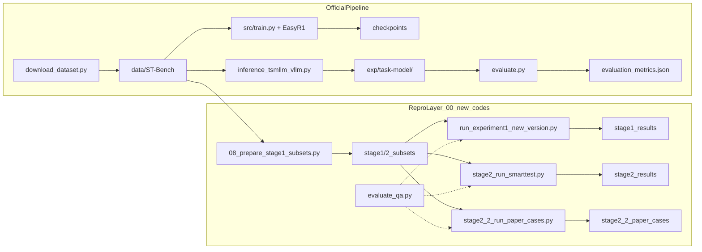
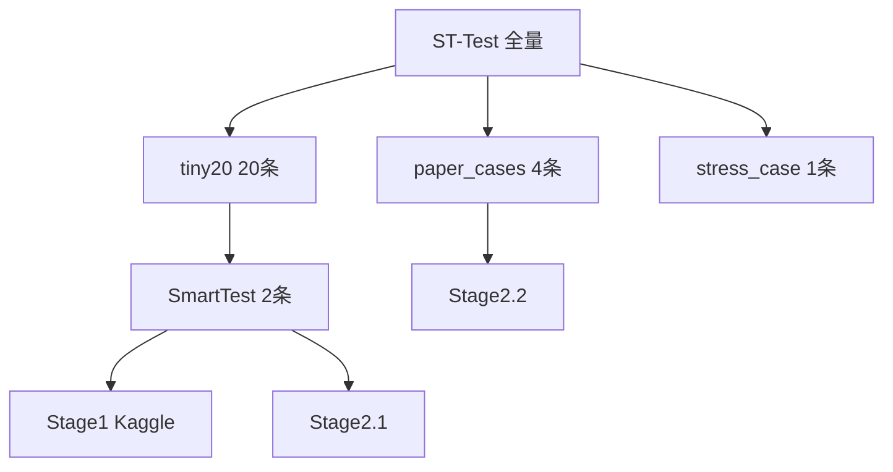
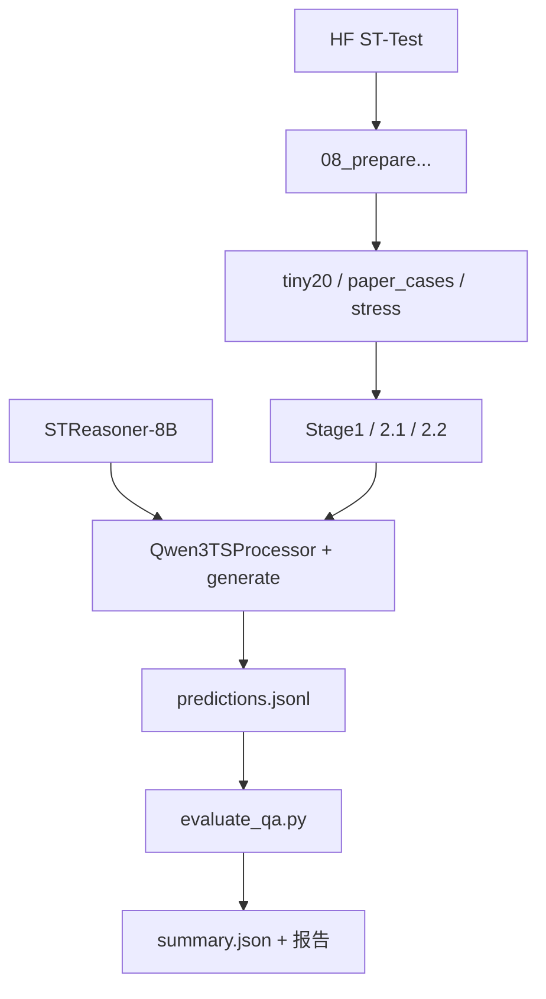

# STReasoner 数据与实验流程路线图

> 日期：2026-05-30  
> 本文档为官方链路速查 + 代码库通读说明；正式流程优先参考根目录原始代码与 `agents修改文件必读规则.md`。

---

## 总览

- 主流程以仓库根目录代码为准：`README.md`、`data_generation/`、`data/`、`scripts/`、`src/`、`inference/`、`evaluation/`。
- `00_new_codes/` 是复现、裁剪、排查和补充脚本区；写正式流程说明时不要只看这里。
- 核心样本字段通常是 `input`、`output`、`timeseries`；推理输出文件使用 `response` 保存模型回答。

## 执行摘要

本仓库是 **ACL 2026 Main 论文 STReasoner** 的完整开源实现，同时叠加了一层 **`00_new_codes` 资源受限复现区**。

**官方路径**（论文 benchmark）：

- 从 HuggingFace 下载 ST-Bench → 三阶段训练（对齐 SFT → CoT SFT → S-GRPO 强化学习）→ 基于 vLLM 的全量 ST-Test 推理 → `evaluation/evaluate.py` 官方评测。

**历史复现路径**（早期 Kaggle / AutoDL 小样本实验；`repro_kaggle/` 与 `repro_autodl/experiments/scripts/stage2_script/` 已**存档**，勿再改勿引用）：

- 裁剪子集 → HuggingFace Transformers 直推 → **Run 诊断**（链路/资源）+ **作者 `evaluate_qa.py` 评分** → 写入 jsonl 与 Markdown 报告。

**关键口径必须区分：**

- `00_new_codes` 里的 **Stage 1 / Stage 2.1 / Stage 2.2** 是**复现实验编号**，与官方 README 中的 **训练 Stage 1/2/3**（SFT + RL）不是同一套编号。
- **SmartTest（2 条）** 和 **paper_cases（4 条）** 仅用于链路验证、资源对比和论文样例回归，**不能代表完整 ST-Test 四类任务的整体效果**。
- 正式 ST-Test 实验要求 `max_tokens=6144`；低于此值的结果只能记为预跑或链路检查。
- 主实验只评测模型原始 `response`，生成后不得改写、补格式或重跑挑最好结果（见 `agents修改文件必读规则.md`）。

---

# 第一部分：官方链路速查

## 0. 环境、缓存、模型文件

- 入口 / 说明：
  - `README.md`
  - `requirements.txt`
  - `cache_config.py`
- 模型下载：
  - `download_model.py`
  - `base_model/`
  - `/root/autodl-tmp/cache/huggingface`
- 当前 AutoDL 复现可用模型：
  - `base_model/STReasoner-8B/`
  - HF repo 名：`Time-HD-Anonymous/STReasoner-8B`

## 1. 数据下载

- 入口：
  - `download_dataset.py`
- 来源：HuggingFace `Time-HD-Anonymous/ST-Bench`
- 输出：
  - `data/ST-Bench/`
- 主要子集：
  - `data/ST-Bench/ST-Align/` — 对齐 SFT
  - `data/ST-Bench/ST-SFT/`、`ST-CoT/` — CoT 冷启动
  - `data/ST-Bench/ST-RL/` — RL
  - `data/ST-Bench/ST-Test/` — 测试集（`forecasting_test.jsonl`、`entity_test.jsonl`、`etiological_test.jsonl`、`correlation_test.jsonl`）
  - `data/ST-Bench/ST-Causal/` — 因果推理变体

## 2. 数据生成

- 总说明：
  - `data_generation/README.md`
- Stage 1：生成 STS 场景并运行 SDE 模拟
  - `data_generation/run_pipeline.py`
  - `data_generation/demo_sts_sde.py`
  - `data_generation/llm_client.py`
  - 输出到 `data_generation/batch_output/`
- Stage 2：从模拟结果生成 QA
  - `data_generation/generate_alignment_QA.py`
  - `data_generation/generate_reasoning_QA.py`
  - `data_generation/generate_reasoning_forecasting_QA.py`
  - prompt 在 `data_generation/prompts/`
  - 输出到 `data/alignment/`、`data/reasoning_before_filter/`
- Stage 3：过滤样本
  - `data/filter.py`
  - `data/reasoning_before_filter/` -> `data/reasoning/`
- Stage 4：CoT / RL 数据构造
  - `data_generation/generate_cot.py`
  - 依赖一次推理输出 `exp/<exp>/generated_answer.json`
- Stage 5：文本 / 图像变体
  - `data/convert_to_text.py`
  - `data/convert_to_image.py`
  - 输出到 `data/reasoning_text/`、`data/reasoning_image/`

## 3. 数据注册

- 数据集映射：
  - `data/dataset_info.json`
- SFT 训练读取字段：
  - `prompt` -> `input`
  - `response` -> `output`
  - `timeseries` -> `timeseries`
- 样本核心字段：
  - `input`：自然语言问题，含 `<ts><ts/>` 占位符
  - `timeseries`：float 数组列表
  - `output`：gold（CoT + `<answer>` 或数值序列）

## 4. 基座模型准备

- 下载基座：
  - `download_model.py`（例如 `--repo_id Qwen/Qwen3-8B` → `base_model/Qwen3-8B/`）
- 加入 STReasoner 自定义代码（从模板目录拷贝到已下载的基座目录）：
  - 模板：`base_model/Config-Qwen3-8B/`（内含 `configuration_qwen3_ts.py`、`modeling_qwen3_ts.py`、`processing_qwen3_ts.py` 等）
  - 拷贝命令（见根目录 `README.md`）：`cp -rf base_model/Config-Qwen3-8B/* base_model/Qwen3-8B/`
- 初始化时间序列编码器：
  - `initial_model.py --model_path base_model/Qwen3-8B`
- 架构：`Qwen3TSForCausalLM` + `TimeSeriesEmbedding`（patch_size=8）；类名不代表换了别的实验模型。

## 5. Stage 1 / Stage 2 SFT

- 训练入口：
  - `scripts/qwen3-8b/train_stage1.sh`
  - `scripts/qwen3-8b/train_stage1+2.sh`
  - 其他模型尺寸在 `scripts/qwen3-14b/`、`scripts/qwen3-4b-instruct/`
- 训练框架：
  - `src/train.py`
  - `src/llamafactory/`（`mm_plugin.py` 的 `ChatTSPlugin`、`timeseries.py` 独立 LR/LoRA）
- Stage 1 数据：`alignment` — 时间序列对齐
- Stage 2 数据：`entity_cot`、`etiological_cot`、`correlation_cot`、`forecasting_cot` — 冷启动推理 / CoT SFT（模板 `STReasoner-CoT`）
- 硬件假设：**8× NVIDIA A100-80GB**；SFT 用 conda `str`

## 6. Stage 3 RL

- 训练入口：
  - `scripts/qwen3-8b/train_stage1+2+3.sh`
  - `scripts/qwen3-8b/train_stage1+2+3_w_spatial.sh`
- RL 框架：
  - `src/EasyR1/`
  - `src/EasyR1/verl/trainer/main.py`（`enable_spatial_reward=true`）
  - `src/EasyR1/examples/config.yaml`
- 奖励函数：
  - `src/EasyR1/examples/reward_function/str.py`
- RL 数据：
  - `data/ST-Bench/ST-RL/*.jsonl`
- 验证数据：
  - `data/ST-Bench/ST-Test/*.jsonl`
- RL 用 Docker `hiyouga/verl:...`

## 7. checkpoint 合并

- 入口：
  - `model_merger.py`
- 输入：
  - `checkpoints/easy_r1/.../actor/`
- 输出：
  - `checkpoints/easy_r1/.../actor/huggingface/`

## 8. 推理

- 入口：
  - `inference/inference_tsmllm_vllm.py`
- vLLM / ChatTS 注册：
  - `inference/vllm/chatts_vllm.py`
  - `inference/llm_utils.py`
- prompt 后缀：
  - `inference/prompt.json`
  - `inference/prompt_utils.py`
- 输入数据：
  - `data/ST-Bench/ST-Test/*.jsonl`
  - `data/ST-Bench/ST-Causal/causal.jsonl`
- 输出：
  - `exp/<task>-<model>/generated_answer.json`
- 流程：读 ST-Test JSONL → `get_prompt_suffix()` → `LLMClient(engine="vllm-ts")` → 写 `response`
- 默认参数：`max_tokens=512`，`temperature=0.2`；**正式 ST-Test 需 `max_tokens=6144`**

## 9. 评测

- 入口：
  - `evaluation/evaluate.py`（从文件路径跑时加 `PYTHONPATH=.`）
- 具体指标：
  - `evaluation/evaluate_qa.py`
- 输入：
  - 测试集 JSONL
  - `exp/<task>-<model>/generated_answer.json`
- 输出：
  - `exp/<task>-<model>/evaluation_metrics.json`
- 流程：读 gold → 读 prediction 的 `response` → tag-first 解析 → 算指标
  - forecasting → MAE、MAPE、coverage
  - entity/etiological/correlation → accuracy（`<answer>` 内单个 A–D）
- 示例输出：`exp_STReasoner-8B/reasoning_*-STReasoner-8B/`

## 10. 当前复现实验区

- 复现脚本：
  - `00_new_codes/repro_autodl/experiments/scripts/`
  - `00_new_codes/repro_kaggle/`（**存档**）
- paper cases 数据：
  - `00_new_codes/repro_kaggle/experiments/stage1_subsets/exp1_resource_tiny20/paper_cases/`
  - `00_new_codes/repro_autodl/experiments/stage2_2_subsets/experiment1_paper_cases/`
- smoke / 临时输出：
  - `00_new_codes/repro_autodl/experiments/stage2_2_smoke/`
- 报告：
  - `00_new_codes/reports/`
- 其他维护指南：
  - `00_new_codes/guides/agents修改文件必读规则.md`
  - `00_new_codes/guides/dataset-ST-Bench使用说明.md`

> **本地注意**：`base_model/` 与 `data/ST-Bench/` 常被 `.gitignore` 忽略，克隆后需运行 `download_model.py` / `download_dataset.py`。

---

# 第二部分：仓库地图

## 2.1 双区域划分

| 区域 | 核心目录 | 作用 |
|------|----------|------|
| **官方（论文原文/源码）** | `data/`、`data_generation/`、`src/`、`scripts/`、`inference/`、`evaluation/`、`base_model/`、`exp_STReasoner-8B/`、`paper/` | 论文完整 pipeline |
| **复现（新代码）** | `00_new_codes/reports/`、`guides/`、`tools/`；`repro_kaggle/`、`repro_autodl/.../stage2_script/` **已存档** | 排查报告、维护指南；早期脚本仅作历史参考 |

## 2.2 官方根目录各文件夹

| 目录/文件 | 作用 |
|-----------|------|
| `README.md` | 官方主文档 |
| `requirements.txt` | SFT 环境依赖 |
| `cache_config.py` | HF / torch 缓存路径 |
| `download_dataset.py` | 下载 ST-Bench |
| `download_model.py` | 下载 Qwen 基座 |
| `initial_model.py` | `ts_encoder` Xavier 初始化 |
| `model_merger.py` | RL checkpoint 合并 |
| `data/` | `dataset_info.json`、过滤与变体转换 |
| `data_generation/` | Network SDE 数据合成 |
| `base_model/` | 权重与自定义 TS 代码 |
| `scripts/` | 训练 shell |
| `src/` | LLaMA-Factory SFT + EasyR1 RL |
| `ds_config/` | DeepSpeed 配置 |
| `inference/` | vLLM 推理 |
| `evaluation/` | 官方评测 |
| `exp_STReasoner-8B/` | 官方示例输出 |
| `paper/` | 论文全文 |
| `figures/` | 论文配图 |

## 2.3 `00_new_codes` 各文件夹

| 目录 | 作用 |
|------|------|
| `guides/` | `pipeline_map.md`（本文档）、`agents修改文件必读规则.md`、`dataset-ST-Bench使用说明.md` |
| `reports/` | 任务日志、排查报告、artifacts |
| `repro_kaggle/` | **存档**：Stage 1 Kaggle 四精度实验 |
| `repro_autodl/` | Stage 2.1 / 2.2 AutoDL 小样本实验 |
| `tools/` | JSON/JSONL → Markdown/Excel 预览 |

## 2.4 仓库双轨总览



---

# 第三部分：`00_new_codes` 详解

## 3.1 `repro_kaggle/` — **存档**

> **勿改勿引用**。以下仅供理解历史报告与结果目录。

```
repro_kaggle/
├── 00_smoke_test_scripts/     # 01–08 序贯 smoke
├── experiments/
│   ├── scripts/stage1_script/
│   ├── stage1_subsets/
│   ├── stage1_results/
│   └── stage1_docs/
└── outputs/
```

| 脚本 | 作用 |
|------|------|
| `00_check_kaggle_env.py` | 检查 GPU、CUDA、依赖 |
| `08_prepare_stage1_exp1_subsets.py` | 从 HF 抽取 tiny20、paper cases、stress case |

**实验一主脚本**：`experiments/scripts/stage1_script/run_experiment1_new_version.py`

- 命令：`prepare` / `run-config` / `run-all` / `summarize`
- 当前实际跑的数据：SmartTest 2 条
- 评测：**Run** 诊断 + **`evaluate_qa.py`** 正式指标

| 配置 | 加载方式 |
|------|----------|
| `4bit_single` | BitsAndBytes nf4 |
| `8bit_single` | `load_in_8bit` |
| `fp16_single` | `torch.float16` 单卡 |
| `fp16_dual` | 双卡 `device_map="balanced"` |

**中文导读**：`experiments/stage1_docs/streasoner_code_reading/`

## 3.2 `repro_autodl/`

- **存档**：`experiments/scripts/stage2_script/`
- **非存档**：`stage2_run_smarttest.py`、`stage2_2_run_paper_cases.py`

| 阶段 | 脚本 | 数据 | max_new_tokens |
|------|------|------|----------------|
| Stage 2.1 | `stage2_run_smarttest.py` | SmartTest 2 条 | 2048 |
| Stage 2.2 | `stage2_2_run_paper_cases.py` | paper_cases 4 条 | 6144 |

Stage 2.2：`response` 字段对齐 evaluate；`run-all` 一次加载、循环复用；默认 `--format-prompt true`。

历史调试：`experiments/results/2.1_smarttest_smoketest/`、`2.2_consequences/`。

## 3.3 `reports/` 与 `tools/`

- `reports/`：实验设计 prompt、排查报告、字段收敛报告、`artifacts/sttest_full_6144_*`
- `tools/json_to_md_table.py`：jsonl 转表格人工检查

---

# 第四部分：端到端数据通路

## 4.1 样本金字塔



| 子集 | 条数 | 用途 |
|------|------|------|
| tiny20 | 20 | 小规模能力探测 |
| SmartTest | 2 | 实验一 / 2.1 主跑 |
| paper_cases | 4 | 论文 case 回归 |
| stress_case | 1 | 长输入压力测试 |

## 4.2 复现层数据流



## 4.3 推理输入构造（复现路径）

1. 读 `input`、`timeseries`、`output`（gold）
2. 校验 `<ts><ts/>` 数量 = `len(timeseries)`
3. `Qwen3TSProcessor` 编码 → `model.generate` → decode
4. timeseries merge device patch

## 4.4 输出格式差异

| 来源 | 文件 | 模型文本字段 |
|------|------|-------------|
| 官方 | `generated_answer.json` | `response` |
| Stage1 | `main_predictions_new.jsonl` | `decoded_text`（嵌套） |
| Stage2 | `predictions.jsonl` | `decoded_text` |
| Stage2.2 | `predictions.jsonl` | `response` |

Stage2 输出三件套：`predictions.jsonl`、`summary.json`、`run.log`。显存字段：`gpu_peak_memory`。

## 4.5 评测口径（Run + evaluate）

| 部分 | 用途 | 说明 |
|------|------|------|
| **Run** | 链路/资源 | `generate_success`、`latency_sec`、`gpu_peak_memory` |
| **Evaluate** | 正式指标 | `evaluate_qa.py`；**coverage** = 可解析样本占比 |

不另维护 Strict/Official 双层。早期 `strict_diagnostic` 仅作历史 jsonl 字段。

---

# 第五部分：两条推理路径对比

| 维度 | 官方 vLLM | 复现 Transformers |
|------|-----------|-------------------|
| 入口 | `inference_tsmllm_vllm.py` | stage1 / stage2 runner |
| 引擎 | vLLM-TS 多 GPU | HF + 量化或 fp16 单卡 |
| 默认 max_tokens | 512 | 2048（2.1）；6144（2.2 / 正式） |
| 数据规模 | 全量 ST-Test | SmartTest / paper_cases / tiny20 |
| 目的 | 论文 benchmark | smoke / 链路排查（存档区） |

两条路径评分均走 `evaluate_qa.py`，复现不走 vLLM 引擎。

---

# 第六部分：当前实验进度

| 复现实验 | 状态 | 说明 |
|----------|------|------|
| Stage1 4bit / 8bit | 已完成 | `stage1_results/experiment1_precision_resource/` |
| Stage1 fp16 | 曾受阻 | 格式问题 vs 模型能力需区分 |
| Stage2.1 | smoketest 已有 | `results/2.1_smarttest_smoketest/` |
| Stage2.2 | 多轮调试 | `2.2_consequences/`；待 format-prompt 重跑 |
| 完整 ST-Test 6144 | 有 artifacts | `reports/artifacts/sttest_full_6144_*` |

待办见 `reports/17-后续需要修改的问题.md`。规则见 `agents修改文件必读规则.md`。

---

# 第七部分：关键文件速查

| 我想… | 看哪个文件 |
|-------|-----------|
| 了解项目整体 | 根目录 `README.md` |
| 下载 ST-Bench | `download_dataset.py` |
| 准备基座模型 | `download_model.py` → `cp Config-Qwen3-8B/*` → `initial_model.py` |
| 跑官方 SFT / RL | `scripts/qwen3-8b/train_stage1*.sh` / `train_stage1+2+3*.sh` |
| 跑官方全量推理 | `inference/inference_tsmllm_vllm.py` |
| 跑官方评测 | `evaluation/evaluate.py` |
| ST-Bench 字段与子集规范 | `guides/dataset-ST-Bench使用说明.md` |
| 准备复现子集 | `repro_kaggle/.../08_prepare_stage1_exp1_subsets.py` |
| 跑 Paper Cases | `repro_autodl/.../stage2_2_run_paper_cases.py` |
| 查实验规则 | `guides/agents修改文件必读规则.md` |
| jsonl 转表格 | `tools/json_to_md_table.py` |
| 读论文 | `paper/STReasoner_ACL_2026.txt` |

---

## 附录：术语对照

| 术语 | 含义 |
|------|------|
| 官方训练 Stage 1/2/3 | SFT 对齐 → CoT SFT → S-GRPO RL |
| 复现 Stage 1 / 2.1 / 2.2 | Kaggle 四精度 / SmartTest / Paper Cases |
| ST-Bench / ST-Test | benchmark 数据集 / 测试子集 |
| SmartTest | 2 条 smoke 样例 |
| paper_cases | 论文 Appendix 匹配 ST-Test 的 4 条 |
| `Qwen3TSForCausalLM` | STReasoner 加载类，非独立模型 |
| `response` | 官方预测中的模型原始输出字段 |
| **coverage** | 可评分数 ÷ 总样本数 |
| **Run 诊断** | 生成链路/资源；不算 accuracy |
