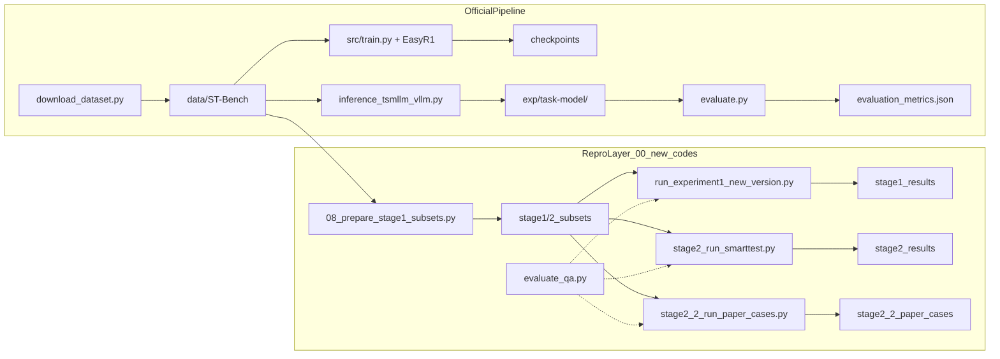
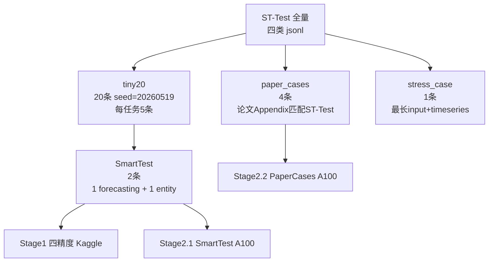
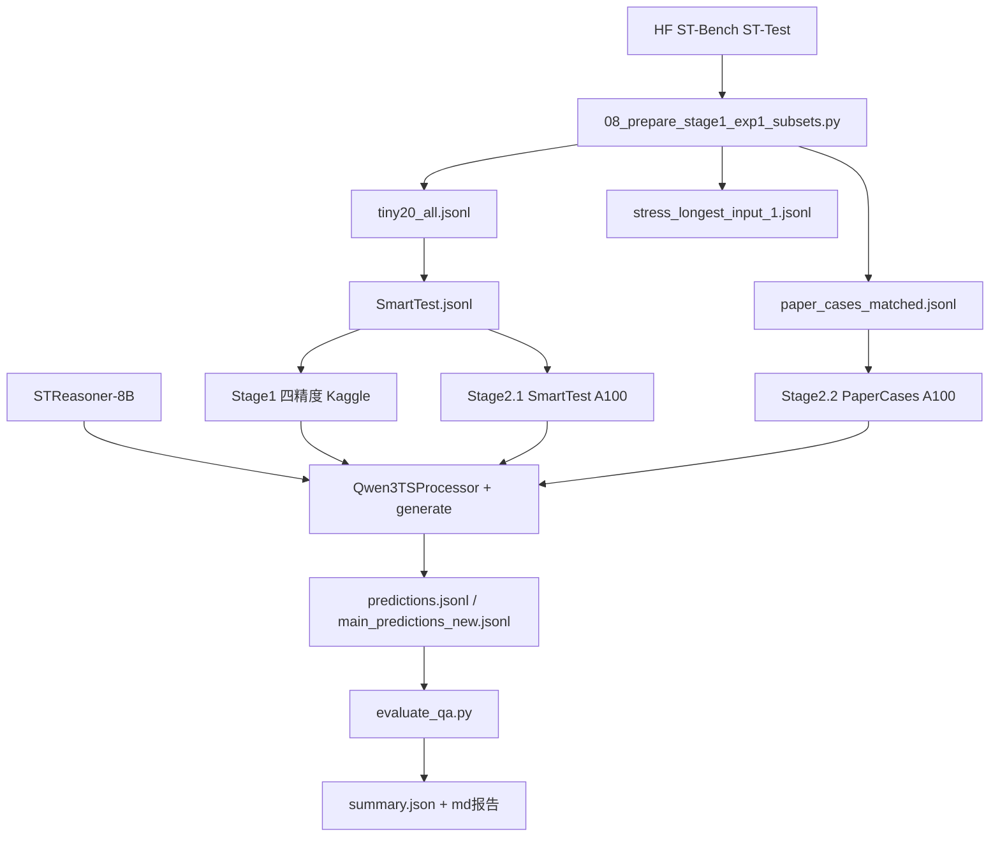

# 代码库整体理解与数据通路考核报告

> 日期：2026-05-30  
> 目的：通读代码后，说明各文件夹职责、端到端数据通路，以及官方 pipeline 与复现实验的关系。

---

## 1. 执行摘要（考核结论）

本仓库是 **ACL 2026 Main 论文 STReasoner** 的完整开源实现，同时叠加了一层 **`00_new_codes` 资源受限复现区**。

**官方路径**（论文 benchmark）：

- 从 HuggingFace 下载 ST-Bench → 三阶段训练（对齐 SFT → CoT SFT → S-GRPO 强化学习）→ 基于 vLLM 的全量 ST-Test 推理 → `evaluation/evaluate.py` 官方评测。

**历史复现路径**（早期 Kaggle / AutoDL 小样本实验；`repro_kaggle/` 与 `repro_autodl/experiments/scripts/stage2_script/` 已**存档**，勿再改勿引用）：

- 裁剪子集 → HuggingFace Transformers 直推 → **Run 诊断**（链路/资源）+ **作者 `evaluate_qa.py` 评分** → 写入 jsonl 与 Markdown 报告。

---

## 2. 仓库顶层地图

### 2.2 官方根目录各文件夹

| 目录/文件 | 作用 |
|-----------|------|
| `README.md` | 官方主文档：环境、训练、推理、评测命令 |
| `requirements.txt` | SFT 环境依赖（vllm 0.8.5、deepspeed、transformers 等） |
| `cache_config.py` | HF / torch 缓存路径（Windows、AutoDL、Kaggle 共用逻辑） |
| `initial_model.py` | 对 `ts_encoder` 做 Xavier 初始化 |
| `model_merger.py` | RL checkpoint 合并为 HuggingFace 格式 |
| `data/` | 数据集注册（`dataset_info.json`）、过滤与 text/image 变体转换 |
| `data_generation/` | Network SDE 多智能体数据合成 pipeline，可重建 ST-Bench |
| `base_model/` | 模型权重与自定义 TS 代码（`Config-Qwen3-8B/` 等；通常 gitignore，本地可能为空） |
| `scripts/` | 按模型规模组织的训练 shell（`qwen3-8b/`、`qwen3-14b/` 等） |
| `src/` | 训练框架：`train.py` → LLaMA-Factory；`EasyR1/` → S-GRPO RL |
| `ds_config/` | DeepSpeed 配置文件 |
| `inference/` | vLLM 推理入口、`llm_utils.py`、`vllm/chatts_vllm.py`（Qwen3TS 多模态注册） |
| `evaluation/` | `evaluate.py` + `evaluate_qa.py` 官方评测 |
| `exp_STReasoner-8B/` | 官方模型示例推理/评测输出 |
| `paper/` | 论文文本 `STReasoner_ACL_2026.txt` |
| `figures/` | 论文配图 |

### 2.3 `00_new_codes` 各文件夹

| 目录 | 作用 |
|------|------|
| `guides/` | 维护指南：`pipeline_map.md`（官方链路索引）、`agents修改文件必读规则.md`（硬规则、存档路径、经验与日志约定） |
| `reports/` | 任务日志、排查报告、实验设计 prompt、artifacts（如 ST-Test 6144 摘要） |
| `repro_kaggle/` | **Stage 1**：Kaggle T4×2 低资源复现（环境 smoke、样本准备、四精度实验） |
| `repro_autodl/` | **Stage 2.1 / 2.2**：AutoDL A100 fp16 单卡 SmartTest 与 paper cases |
| `tools/` | 本地辅助工具（JSON/JSONL → Markdown/Excel 预览） |
| `.obsidian/` | Obsidian 笔记配置，与实验逻辑无关 |

### 2.4 仓库双轨总览



---

## 3. 官方代码详解（论文原文/源码）

官方流程以根目录 `README.md` 和 `00_new_codes/guides/pipeline_map.md` 为准；`00_new_codes` 只做复现与审计，不替代官方 pipeline。

### 3.1 数据层

**下载**

- 入口：`download_dataset.py`
- 来源：HuggingFace `Time-HD-Anonymous/ST-Bench`
- 输出：`data/ST-Bench/`
- 主要子集：
  - `ST-Align/` — Stage 1 对齐 SFT
  - `ST-SFT/`、`ST-CoT/` — Stage 2 CoT 冷启动
  - `ST-RL/` — Stage 3 RL
  - `ST-Test/` — 测试集（`forecasting_test.jsonl`、`entity_test.jsonl`、`etiological_test.jsonl`、`correlation_test.jsonl`）
  - `ST-Causal/` — 因果推理变体

**合成（可选，论文数据重建）**

- 总说明：`data_generation/README.md`
- Stage 1：`data_generation/run_pipeline.py` — Network SDE 多智能体生成 STS 场景
- Stage 2：`generate_alignment_QA.py`、`generate_reasoning_QA.py` 等 → `data/alignment/`、`data/reasoning_before_filter/`
- Stage 3：`data/filter.py` 过滤 → `data/reasoning/`
- Stage 4：`data_generation/generate_cot.py`（依赖一次推理输出）
- Stage 5：`data/convert_to_text.py`、`convert_to_image.py` — 文本/图像变体

**注册**

- `data/dataset_info.json` 映射训练字段：`prompt` ← `input`，`response` ← `output`，`timeseries` ← `timeseries`

**样本核心字段**

- `input`：自然语言问题，含 `<ts><ts/>` 占位符对应每条时序
- `timeseries`：float 数组列表
- `output`：gold 答案（CoT + `<answer>` 或数值序列）

### 3.2 模型层

| 步骤 | 文件 | 说明 |
|------|------|------|
| 下载基座 | `download_model.py` | 如 `Qwen/Qwen3-8B` → `base_model/Qwen3-8B/` |
| 注入 TS 代码 | `base_model/Config-Qwen3-8B/` → 拷贝进基座目录 | 模板含 `configuration_qwen3_ts.py`、`modeling_qwen3_ts.py`、`processing_qwen3_ts.py`；`cp -rf base_model/Config-Qwen3-8B/* base_model/Qwen3-8B/`（见 `README.md`） |
| 初始化编码器 | `initial_model.py` | 对拷贝后的目录执行 `--model_path base_model/Qwen3-8B`；`ts_encoder` Xavier 初始化 |
| 架构 | — | `Qwen3TSForCausalLM` + `TimeSeriesEmbedding`（patch_size=8 MLP 编码） |
| RL 合并 | `model_merger.py` | `checkpoints/.../actor/` → `.../actor/huggingface/` |

`Qwen3TSForCausalLM` 是 STReasoner-8B 的**加载架构类名**，不代表换成了别的实验模型。

### 3.3 训练层（官方三阶段）

| 官方 Stage | 方法 | 入口 | 数据 | 框架 |
|:--------:|------|------|------|------|
| 1 | 对齐 SFT | `scripts/qwen3-8b/train_stage1.sh` | `alignment` | `src/train.py` → LLaMA-Factory + `ChatTSPlugin` |
| 2 | CoT SFT | `scripts/qwen3-8b/train_stage1+2.sh` | `*_cot` 四类 | 同上，模板 `STReasoner-CoT` |
| 3 | S-GRPO RL | `scripts/qwen3-8b/train_stage1+2+3_w_spatial.sh` | `ST-RL/*.jsonl` | `src/EasyR1/verl/trainer/main.py`，`enable_spatial_reward=true` |

硬件假设：**8× NVIDIA A100-80GB**；SFT 用 conda `str`，RL 用 Docker `hiyouga/verl:...`。

SFT 侧关键改造在 `src/llamafactory/`（`mm_plugin.py` 的 `ChatTSPlugin`、`timeseries.py` 独立 LR/LoRA）；RL 奖励在 `src/EasyR1/examples/reward_function/str.py`。

### 3.4 推理与评测

**推理**

```
inference/inference_tsmllm_vllm.py
  ├─ 读 ST-Test JSONL（input + timeseries）
  ├─ prompt_utils.get_prompt_suffix() ← inference/prompt.json
  ├─ LLMClient(engine="vllm-ts") ← inference/llm_utils.py
  │     └─ worker_vllm_ts → vLLM + inference/vllm/chatts_vllm.py
  └─ 写 exp/<task>-<model>/generated_answer.json
```

默认参数：`max_tokens=512`，`temperature=0.2`，默认 8 GPU / 每副本 2 GPU。完整 ST-Test 正式实验需 `max_tokens=6144`。

**评测**

```
evaluation/evaluate.py
  ├─ load_jsonl_dataset() — gold
  ├─ load_prediction_files() — generated_answer.json 的 response
  └─ evaluate_predictions_for_task() ← evaluation/evaluate_qa.py
       ├─ forecasting → MAE、MAPE、coverage
       └─ entity/etiological/correlation → accuracy（`<answer>` 内单个 A–D，tag-first）
```

示例输出在 `exp_STReasoner-8B/reasoning_*-STReasoner-8B/`。

### 3.5 辅助资源

- `paper/STReasoner_ACL_2026.txt` — 论文全文
- `evaluation_interface.html` — 评测界面
- `cache_config.py` — 跨平台缓存路径统一

> **本地注意**：`base_model/` 与 `data/ST-Bench/` 常被 `.gitignore` 忽略，克隆后需运行 `download_model.py` / `download_dataset.py` 才有完整权重与数据。

---

## 4. `00_new_codes` 详解（新代码）

### 4.1 `guides/`

| 文件 | 内容 |
|------|------|
| `pipeline_map.md` | 端到端数据/实验路线图索引（从官方 download 到 `00_new_codes` 复现区） |
| `agents修改文件必读规则.md` | 硬规则、存档目录、写报告/写日志约定、AutoDL 环境、Stage 2.2 / ST-Test 经验 |

### 4.2 `repro_kaggle/` — **存档**（原 Stage 1 Kaggle T4×2）

> **勿改勿引用**。以下描述仅供理解历史报告与结果目录；新任务请走官方 pipeline 或当前非存档路径。

**目录结构**

```
repro_kaggle/
├── 00_smoke_test_scripts/     # 01–08 序贯 smoke
├── experiments/
│   ├── scripts/stage1_script/ # 实验一主脚本
│   ├── stage1_subsets/        # 固定样本子集
│   ├── stage1_results/        # 归档结果
│   └── stage1_docs/           # 报告 + streasoner_code_reading 导读
└── outputs/                   # 现场运行缓存（非正式归档）
```

**Smoke 脚本链（`00_smoke_test_scripts/`）**

| 脚本 | 作用 |
|------|------|
| `00_check_kaggle_env.py` | 检查 GPU、CUDA、依赖、HF cache |
| `01_setup_kaggle_t4.sh` | 安装依赖、配置 cache |
| `02_inspect_stbench.py` | 检查 ST-Bench 各 subset 可读性 |
| `03_load_streasoner_smoke.py` | 4bit 加载 STReasoner-8B + 极小生成 |
| `04_run_one_sttest_sample.py` | 单条 ST-Test 完整推理链路 |
| `05_eval_sttest_tiny.py` | 5–20 条 tiny eval，含 parser/accuracy；timeseries merge device patch 来源 |
| `06_compare_single4bit_dualfp16.sh` | 4bit 单卡 vs fp16 双卡对照 |
| `07_parse_fix_experiment.sh` | 输出格式修复实验 |
| `08_prepare_stage1_exp1_subsets.py` | **不跑模型**：从 HF 抽取 tiny20、paper cases、stress case |

**实验一主脚本**：`experiments/scripts/stage1_script/run_experiment1_new_version.py`

- 命令：`prepare` / `run-config --config {4bit_single|8bit_single|fp16_single|fp16_dual}` / `run-all` / `summarize`
- 模型：`Time-HD-Anonymous/STReasoner-8B`
- **当前实际跑的数据**：仅 SmartTest 2 条（`DATA_GROUPS = {"main": SmartTest.jsonl}`）
- **评测口径**（与作者一致，不另造 Strict/Official 双层）：
  1. **Run**：加载、generate/decode、资源占用
  2. **评分**：调用 `evaluation/evaluate_qa.py`（accuracy / MAE / MAPE / coverage）
  - 早期脚本里曾有 `strict_diagnostic` 块，仅为排查 prompt 格式；**正式指标以 evaluate 为准**。

**四精度配置**

| 配置 | 加载方式 |
|------|----------|
| `4bit_single` | `BitsAndBytesConfig(load_in_4bit=True, nf4)` |
| `8bit_single` | `load_in_8bit` |
| `fp16_single` | `torch.float16`，`device_map={"":0}` |
| `fp16_dual` | `CUDA_VISIBLE_DEVICES=0,1`，`device_map="balanced"` |

**中文代码导读**：`experiments/stage1_docs/streasoner_code_reading/`（22 篇，含 `02_official_pipeline.md`、`05_inference_flow.md`、`12_evaluation_flow.md`、`13_paper_to_code_mapping.md` 等）

### 4.3 `repro_autodl/` — 部分存档 + 部分仍可能使用

- **存档**：`experiments/scripts/stage2_script/`（旧 Stage 2 脚本目录，勿改勿引用）。
- **非存档脚本**（若继续小样本 HF 实验）：`experiments/scripts/stage2_run_smarttest.py`、`stage2_2_run_paper_cases.py`。
- **数据/结果**：`stage2_subsets/`、`experiments/results/` 等仍可能被报告引用。

| 阶段 | 脚本 | 数据 | max_new_tokens | 输出默认目录 |
|------|------|------|----------------|--------------|
| **Stage 2.1 SmartTest** | `experiments/scripts/stage2_run_smarttest.py` | SmartTest 2 条 | 2048 | `stage2_results/experiment1_smarttest/` |
| **Stage 2.2 Paper Cases** | `experiments/scripts/stage2_2_run_paper_cases.py` | 论文 4 case | 6144 | `stage2_2_paper_cases/` |

两者从 Kaggle stage1 脚本复用：`build_inputs()`、`Qwen3TSProcessor`、`generate/decode`、timeseries merge device patch。

Stage 2.2 特点：

- 模型文本字段名为 `response`（对齐 `evaluate_qa.load_prediction_files`）
- `run-all` 应一次加载模型、循环复用，不每条重载

历史调试目录：`experiments/results/2.1_smarttest_smoketest/`、`2.2_consequences/`（baseline / parserfix）。

### 4.4 `reports/`

| 类型 | 示例文件 |
|------|----------|
| 实验设计 prompt | `01-三种数据集抽取设计.md`、`02-四配置实验设计.md`、`03-单卡A100实验设计.md` |
| 排查/进展报告 | `04-VSC远程连接排查.md`、`09_stage2.2paper_cases效果调试.md` |
| 字段/输出收敛 | `13-2026-05-29-stage2输出文件收敛报告.md`、`16-2026-05-30-gpu_memory字段收敛报告.md` |
| 待办 | `17-后续需要修改的问题.md` |
| artifacts | `artifacts/sttest_full_6144_summary.json` 等 |

### 4.5 `tools/`

- `json_to_md_table.py`：将 prediction JSONL 转为 Markdown 表格或 Excel，便于人工检查 raw response 与解析结果

---

## 5. 端到端数据通路（重点）

### 5.1 样本金字塔

从 ST-Test 全量逐级裁剪，用途逐级收窄：



| 子集 | 条数 | 路径（Stage1 侧） | 用途 |
|------|------|-------------------|------|
| tiny20 | 20 | `repro_kaggle/experiments/stage1_subsets/exp1_resource_tiny20/st_test_tiny20_seed20260519/tiny20_all.jsonl` | 小规模能力探测 |
| SmartTest | 2 | `.../smart_test/SmartTest.jsonl` | 实验一/2.1 主跑数据 |
| paper_cases | 4 | `.../paper_cases/paper_cases_matched.jsonl` | 论文 case 回归 |
| stress_case | 1 | `.../stress_case/stress_longest_input_1.jsonl` | 长输入压力测试 |

paper_cases 由 `08_prepare_stage1_exp1_subsets.py` 按论文 Appendix H Table 6–9 与 ST-Test 文本唯一匹配生成。

### 5.2 复现层完整数据流



### 5.3 推理输入构造（复现路径共用）

1. 读取 jsonl 样本：`input`、`timeseries`、`output`（gold）
2. 校验 `input` 中 `<ts><ts/>` 数量 = `len(timeseries)`
3. `Qwen3TSProcessor(text=..., timeseries=..., return_tensors="pt")` 编码
4. 估算 `input_tokens`（文本 token + ceil(ts_len/8) patch tokens）
5. `model.generate(...)` → decode → 写入预测文件
6. 打 timeseries merge device patch，避免多模态 tensor 设备不一致

### 5.4 输出格式差异

| 来源 | 文件 | 结构 | 模型文本字段 |
|------|------|------|-------------|
| 官方 | `exp/<task>-<model>/generated_answer.json` | JSON 数组 | `response` |
| Stage1 | `main_predictions_new.jsonl` | 嵌套：`sample` / `run` / `strict_diagnostic`（历史调试） / `official_eval` | `decoded_text`（在 `run` 内） |
| Stage2 | `predictions.jsonl` | 扁平 per-sample | `decoded_text` |
| Stage2.2 | `predictions.jsonl` | 扁平 + `paper_case_id` 等元数据 | `response` |

Stage1 嵌套 jsonl 含历史 `strict_diagnostic` 字段；**评分仍只认 `evaluate_qa.py` 输出**。

Stage2 输出已收敛为统一三件套（见 report 13）：

- `predictions.jsonl`
- `summary.json`
- `run.log`

显存字段已收敛为 `gpu_peak_memory`（生成阶段峰值，见 report 16），不再写 before/after 快照。

### 5.5 评测口径（Run + 作者 evaluate）

作者与复现**共用同一套评分**：`evaluation/evaluate.py` → `evaluate_qa.py`。不另维护「Strict 层」与「Official 层」两套尺子。

| 部分 | 用途 | 实现 | 说明 |
|------|------|------|------|
| **Run** | 生成是否成功、延迟、token、显存 | 各 runner 的 `generate_success`、`latency_sec`、`gpu_peak_memory` 等 | 链路/资源诊断，不算分 |
| **Evaluate** | 正式指标 | `evaluation/evaluate_qa.py` | 选择题：`<answer>` 内单个 A–D；forecasting：标签内 JSON/数组；**coverage** = 可解析样本占比 |

早期复现脚本曾额外写 `strict_diagnostic` / `parse_success`，用于排查「没加 format prompt 导致无标签」；在生成侧对齐 `prompt.json` 且 evaluate 收严为 tag-first 后，**与 evaluate 重复，仅作历史 jsonl 字段保留**。

指标映射：

- 多选（entity / etiological / correlation / causal）：**accuracy**、**coverage**
- Forecasting：**MAE**、**MAPE**、**coverage**

---

## 6. 两条推理路径对比

| 维度 | 官方 vLLM | 复现 Transformers |
|------|-----------|-------------------|
| 入口 | `inference/inference_tsmllm_vllm.py` | `run_experiment1_new_version.py` / `stage2_run_smarttest.py` / `stage2_2_run_paper_cases.py` |
| 引擎 | vLLM-TS + 多 GPU 副本 | HF `AutoModelForCausalLM` + BitsAndBytes 量化（Stage1）或 fp16 单卡（Stage2） |
| 默认 max_tokens | 512（README 默认） | 2048（实验一 / 2.1）；6144（2.2 / 正式 ST-Test） |
| 硬件假设 | 8× A100-80GB | Kaggle T4×2 / AutoDL 单 A100 |
| 输出格式 | `generated_answer.json` | jsonl（嵌套或扁平） |
| 数据规模 | 全量 ST-Test 四类 | SmartTest 2 条 / paper_cases 4 条 / tiny20 20 条 |
| 目的 | 论文复现、正式 benchmark | 资源/精度 smoke、链路排查（**存档**）；评分仍走 `evaluate_qa.py` |

两条路径**并行存在**：复现脚本审计并调用官方 `evaluate_qa.py`，但不走 vLLM 引擎。

---

## 7. 当前实验进度与已知口径

基于现有 `reports/` 与 `experiments/results/` 归纳：

| 复现实验 | 状态 | 说明 |
|----------|------|------|
| Stage1 4bit / 8bit | 已完成 | 结果在 `stage1_results/experiment1_precision_resource/` |
| Stage1 fp16 单卡/双卡 | 曾受阻 | strict parse 失败导致暂停；需区分格式问题与模型能力 |
| Stage2.1 SmartTest | smoketest 已有 | `results/2.1_smarttest_smoketest/` |
| Stage2.2 Paper Cases | 多轮调试 | `2.2_consequences/` 下 baseline / parserfix |
| 完整 ST-Test 6144 | 有 artifacts | `reports/artifacts/sttest_full_6144_*`；应用官方 vLLM 路径 |

**待办**（`17-后续需要修改的问题.md`）：

1. 模型输出格式仍不稳定，理论上应按 prompt 生成 `...<answer>...</answer>`
2. parser 原逻辑 vs 新逻辑需详细报告

**必须遵守的规则**（来自 `guides/agents修改文件必读规则.md`）：

- 报告语言为中文
- 不修改提示词文件，新内容另建文件
- 主实验只评测原始 response，不改写、不补格式、不重跑挑结果
- SmartTest / paper_cases 不能替代完整 ST-Test 验证论文整体效果

---

## 8. 关键文件速查索引

| 我想… | 看哪个文件 |
|-------|-----------|
| 了解项目整体 | 根目录 `README.md` |
| 下载 ST-Bench | `download_dataset.py` → `data/ST-Bench/` |
| 下载并准备基座模型 | `download_model.py` → `cp Config-Qwen3-8B/*` → `initial_model.py`（见 `README.md`） |
| 跑官方 SFT 训练 | `scripts/qwen3-8b/train_stage1.sh`、`train_stage1+2.sh` |
| 跑官方 RL 训练 | `scripts/qwen3-8b/train_stage1+2+3_w_spatial.sh` → `src/EasyR1/verl/trainer/main.py` |
| 跑官方全量推理 | `inference/inference_tsmllm_vllm.py` |
| 跑官方评测 | `evaluation/evaluate.py`（加 `PYTHONPATH=.`） |
| 理解 ST-Bench 字段格式 | `00_new_codes/.../streasoner_code_reading/03_data_format.md` |
| 理解官方 pipeline 10 步 | `00_new_codes/.../streasoner_code_reading/02_official_pipeline.md` |
| 准备复现子集 | `00_new_codes/repro_kaggle/00_smoke_test_scripts/08_prepare_stage1_exp1_subsets.py` |
| 跑四精度资源实验 | `00_new_codes/repro_kaggle/experiments/scripts/stage1_script/run_experiment1_new_version.py` |
| 跑 SmartTest（A100） | `00_new_codes/repro_autodl/experiments/scripts/stage2_run_smarttest.py` |
| 跑 Paper Cases（A100） | `00_new_codes/repro_autodl/experiments/scripts/stage2_2_run_paper_cases.py` |
| 查实验一样本索引 | `00_new_codes/repro_kaggle/experiments/experiments文件夹整体说明.md` |
| 查端到端路线图 | `00_new_codes/guides/pipeline_map.md` |
| 查实验规则与环境 | `00_new_codes/guides/agents修改文件必读规则.md` |
| jsonl 转表格人工检查 | `00_new_codes/tools/json_to_md_table.py` |
| 配置 HF 缓存路径 | `cache_config.py` |
| 读论文原文 | `paper/STReasoner_ACL_2026.txt` |
| 查官方示例评测结果 | `exp_STReasoner-8B/reasoning_*-STReasoner-8B/evaluation_metrics.json` |

---

## 附录：术语对照

| 术语 | 含义 |
|------|------|
| 官方训练 Stage 1/2/3 | SFT 对齐 → CoT SFT → S-GRPO RL |
| 复现 Stage 1 | Kaggle 四精度 SmartTest 资源实验 |
| 复现 Stage 2.1 / 2.2 | AutoDL fp16 SmartTest / Paper Cases |
| ST-Bench | 论文 benchmark 数据集 |
| ST-Test | ST-Bench 测试子集，四类推理任务 |
| SmartTest | 从 tiny20 固定的 2 条 smoke 样例 |
| paper_cases | 论文 Appendix 匹配 ST-Test 的 4 条 case study |
| `Qwen3TSForCausalLM` | STReasoner 多模态加载类，非独立模型 |
| `response` | 官方预测文件中的模型原始输出字段名 |
| **coverage** | evaluate 可解析并评分的样本数 ÷ 总样本数 |
| **Run 诊断** | 生成链路是否成功、耗时与显存；不算 accuracy |

---

*本报告为代码库通读后的理解性整合，路径细节以 `00_new_codes/guides/pipeline_map.md` 与 `agents修改文件必读规则.md` 为准；正式流程说明优先参考根目录原始代码。*

**AI实验 其他注意事项：**

- `00_new_codes` 里的 **Stage 1 / Stage 2.1 / Stage 2.2** 是**复现实验编号**，与官方 README 中的 **训练 Stage 1/2/3**（SFT + RL）不是同一套编号。
- **SmartTest（2 条）** 和 **paper_cases（4 条）** 仅用于链路验证、资源对比和论文样例回归，**不能代表完整 ST-Test 四类任务的整体效果**。
- 正式 ST-Test 实验要求 `max_tokens=6144`；低于此值的结果只能记为预跑或链路检查。