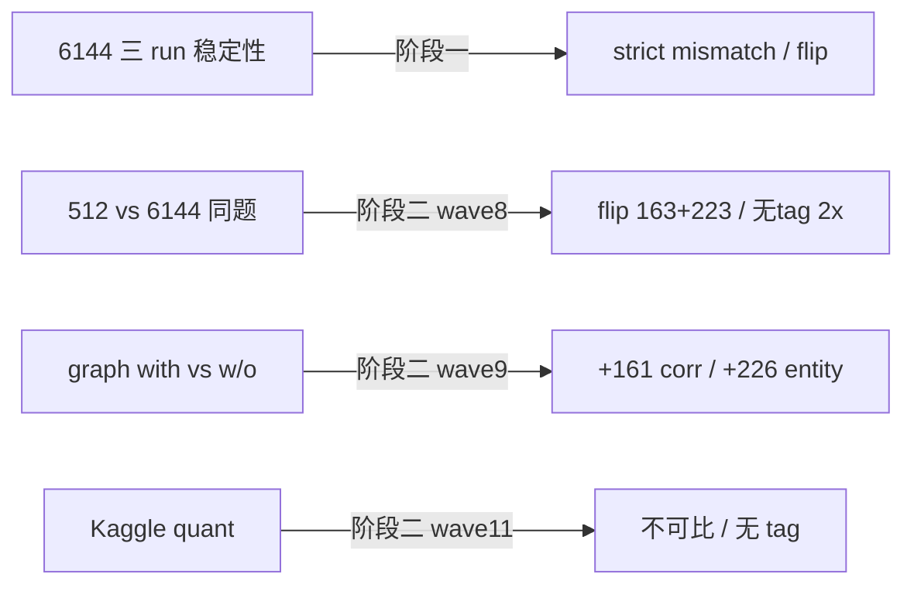

# 阶段二总览（Wave 13）

汇总 [`08-阶段二探索memo.md`](08-阶段二探索memo.md) 与子报告；registry：**71** 实验条目（[`experiment_registry.json`](artifacts/experiment_registry.json)）。

---

## 1. 三轴对照

---

## 2. 统一机制叙事

| 现象 | 阶段一 | 阶段二证据 |
| --- | --- | --- |
| 复述错但选对 | flip ⊥ mismatch | graph rescued 161 中仅 30 有 strict mismatch |
| 假「三不同」 | 无 tag + evaluate 回退 | 6144 无 tag 率 >512；Kaggle 0 tag |
| 长 thinking 触顶 | unclosed numeric loop ~6k | 512/6144 flip 样例 idx 78, 191 |
| Etiological 稳定 | strict mismatch≈0 | 三 run flip 27；graph ±9/6 |

---

## 3. 数据边界

- ~~Paper cases pred null~~ → 已从 `paired_results` + exp 补全（见 `11`）
- 512 vs 6144 aggregate acc 与四格表偶有不一致——以 `evaluation_metrics.json` 为准
- Entity strict mismatch≈0 仍为口径边界（T0-4 外部可选）

---

## 4. 交付物清单

| 类型 | 文件 |
| --- | --- |
| 报告 | `08`–`12`、本总览、`14` |
| Artifacts | `token_budget_*`, `graph_ablation_*`, `etiological_*`, `kaggle_*`, `experiment_registry.json` |
| 脚本 | `compute_registry.py`, `compute_token_budget.py`, `compute_graph_ablation.py`, `compute_eti_paper.py`, `compute_kaggle_precision.py` |

---

## 5. 下一阶段

源码深读与代码–实验 crosswalk：**阶段三** [`15-阶段三总览.md`](15-阶段三总览.md)。可执行 roadmap：**[`14-后续实验与优化计划.md`](14-后续实验与优化计划.md)**。
