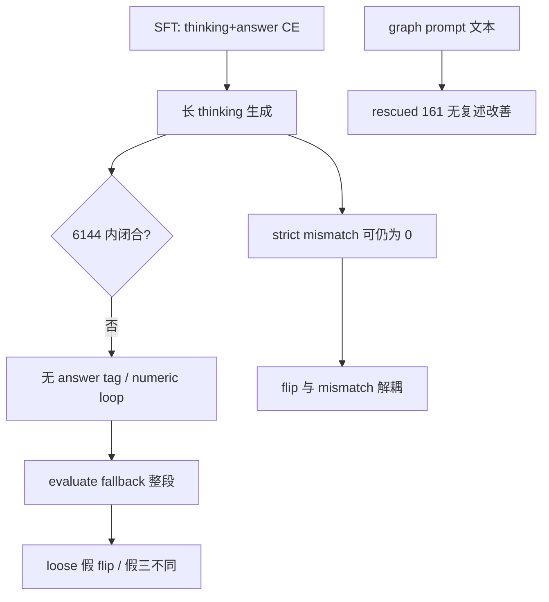

# 代码与实验异常对照（Wave 21）

Artifact：[`code_experiment_crosswalk.json`](artifacts/code_experiment_crosswalk.json)。将阶段一–二 **可观测异常** 映射到源码锚点与 Tier/E 实验。

---

## 1. Crosswalk 表

| 现象 | 代码锚点 | 阶段证据 | Tier / E |
| --- | --- | --- | --- |
| **no_answer / unclosed thinking** | inference `max_tokens=CTX_LENGTH` (L162)；evaluate `_extract_tag_content` 无 tag 回退整段 | wave6–7；512/6144 无 tag 2×；Kaggle 0 tag | T1-2, T1-3, E1 |
| **loose 假三不同** | `load_prediction_files` + `_normalize_choice` | wave5；E2 67→18 | T0-1 ✅ E2 |
| **flip ⊥ mismatch** | evaluate 不计 thinking；SFT 全文 CE (`supervised.py`) | 主报告 §9.3；graph rescued 161 中 mismatch 30 | T1-1, T2-3, T3-1 |
| **graph +6pp** | prompt graph 段；stage2.4 regex remove | rescued 161/226/9 | T1-4, E4 |
| **Kaggle 不可比** | repro_kaggle HF vs `inference_tsmllm_vllm.py` | 4×20 条 audit | 勿用于主优化 |
| **num_tokens 误导** | L331 写 input_token_counts | wave6 + T0-3 ratio 5.8× | T0-3 ✅ 取证 |
| **entity strict≈0** | strict Node 窗口 vs loose 591/1194 | 阶段一 `03` §4 | T2-1 |

---

## 2. 因果链（合成）

---

## 3. Superpowers 已执行 vs 外部规格

| 项 | 状态 | 报告 |
| --- | --- | --- |
| E2 / T0-1 strict reparse | ✅ | [`22`](22-E2-strict-reparse全量对照.md) |
| T0-2 parse 分层 + flip 归因 | ✅ | [`23`](23-T0-2-parse分层与flip归因.md) |
| T0-3 num_tokens 审计 | ✅ | [`25`](25-T0-3-num_tokens字段取证.md) |
| Wave25 真实 flip 账本 | ✅ | [`24`](24-真实不稳定flip账本.md) |
| E1/E3/E4、Tier1+ | 外部 GPU/改源码 | [`14`](14-后续实验与优化计划.md) |

---

## 4. Falsifier 汇总

| 若失败则 | 说明 |
| --- | --- |
| T0-1 后 loose≈strict 三不同 | fallback 不是主因 |
| T1-2 后 unclosed 仍 >2% | 需 stop/template 级修复 |
| T3-1 后 acc 崩 | 模型依赖 thinking CE |
| graph E4 符号反转 | ledger 配置漂移 |
