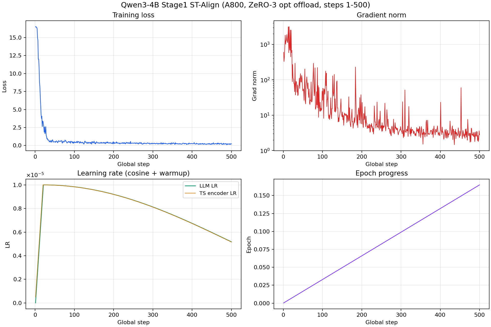
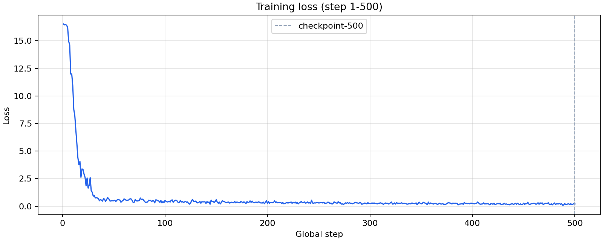
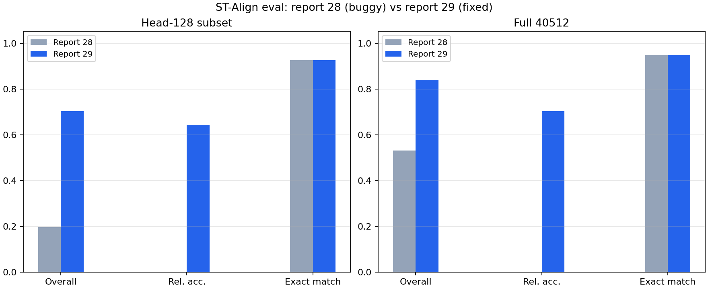

# 服务器2 A800 Qwen3-4B Stage1 checkpoint-500 ST-Align 评测脚本修复复评

日期：2026-06-14

## 1. 做了什么

报告 28 已跑完推理，预测文件未变。本次只修复 `evaluation/evaluate_qa.py` 中 alignment 数值题评分：`target != 0` 时原先只算 `rel_error`、未计入 `rel_sum`/`overall_sum`；现将 `rel_score = max(0, 1 - rel_error)` 对全部数值题统一累加。

复评命令（复用原预测）：

```bash
# head-128
PYTHONPATH=. python evaluation/evaluate.py \
  --task alignment \
  --dataset 00_new_codes/repro_autodl/experiments/eval_subsets/alignment_test_head128.jsonl \
  --exp_path exp/qwen3_4b_stage1_ckpt500_alignment_128

# 全量 40512（仅读 jsonl 的 output 字段，避免 OOM）
# 输出写入 exp/qwen3_4b_stage1_ckpt500_alignment_full/evaluation_metrics.json
```

## 2. 与报告 28 的差异

| 指标 | 子集 | 报告 28 | 报告 29（修复后） |
|---|---:|---:|---:|
| `exact_match` | 128 | 0.9259 | **0.9259**（不变） |
| `relative_accuracy` | 128 | null | **0.6433** |
| `overall_score` | 128 | 0.1953 | **0.7029** |
| `exact_match` | 全量 | 0.9490 | **0.9490**（不变） |
| `relative_accuracy` | 全量 | 0.0 | **0.7031** |
| `overall_score` | 全量 | 0.5305 | **0.8405** |

`coverage` 两次均为 1.0，`missing_predictions=0`，推理链路结论与报告 28 一致。

## 3. 怎么读

- **`exact_match` 不变**：非数值题评分逻辑未改，说明预测本身与报告 28 相同。
- **`relative_accuracy` / `overall_score` 大幅上升**：报告 28 的低估来自 evaluator bug，不是模型突然变好。
- 全量 `overall_score=0.8405` 与报告 28 第 8 节非官方诊断 `diagnostic_overall_score_fixed_logic` **一致**，说明修复后官方脚本与当时手工诊断对齐。

## 4. 产物路径

```text
evaluation/evaluate_qa.py                          # 已修复
exp/qwen3_4b_stage1_ckpt500_alignment_128/evaluation_metrics.json
exp/qwen3_4b_stage1_ckpt500_alignment_full/evaluation_metrics.json
exp/qwen3_4b_stage1_ckpt500_alignment_*/*_report28.json   # 修复前指标备份
00_new_codes/repro_autodl/experiments/logs/qwen3_4b_stage1_ckpt500_alignment_128_evaluate_report29_20260614_120007.log
```

后续 Stage 对比请以报告 29 的 `evaluation_metrics.json` 为准；报告 28 的全量 `overall_score`/`relative_accuracy` 仅作 bug 参考，不可与论文表格直接对比。

## 5. 训练曲线（checkpoint-500，step 1–500）

数据来源：`00_new_codes/repro_autodl/experiments/checkpoints/Qwen3-4B-Instruct-2507-stage1-checkpoint-500-paused/trainer_state.json`（正式训练日志 `...214947_bf16_zero3opt_batch2_ga32_train.log` 对应 run）。

| 指标 | step 1 | step 500 |
|---|---:|---:|
| loss | 16.52 | 0.21 |
| grad_norm | 595.2 | 2.78 |
| learning_rate | 0（warmup 起点） | 5.18e-06 |
| ts_encoder_lr | 5.0e-07 | 5.16e-06 |
| epoch | 0.00033 | 0.165 |



四联图含 loss、grad_norm（对数轴）、双 learning rate、epoch 进度。loss 从 ~16.5 单调降至 ~0.21，warmup 后 cosine 调度正常，未出现 loss 发散或 grad_norm 爆炸。





复现脚本：

```bash
/root/autodl-tmp/conda/envs/str-py310/bin/python \
  00_new_codes/repro_autodl/experiments/scripts/plot_stage1_a800_ckpt500_metrics.py
```

产物目录：

```text
00_new_codes/reports/t3-autodl2-三阶段训练复现/artifacts/stage1_a800_ckpt500/
  training_curves.png
  training_loss.png
  eval_metrics_report28_vs_29.png
  training_summary.json
```
