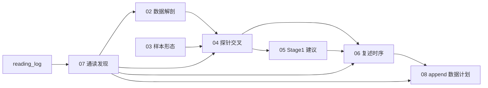

# ST-Align 详细分析 · 索引

修改：2026-06-14  
读者：**Stage 1 训练决策**（确认数据设计问题 → 支撑采样/停训/预期管理）

---

## 数据与工具

| 项 | 路径 / 值 |
|----|-----------|
| 训练 JSONL | [data/ST-Bench/ST-Align/alignment_train.jsonl](../../../../data/ST-Bench/ST-Align/alignment_train.jsonl) |
| 规模 | 旧统计版本为 **153,700 行**；当前本机 `alignment_train.jsonl` 为 **194,212 行**，需重新生成统计 artifact |
| ST-Align 目录合计 | ~**3.08 GB**（含 test + 合并版 `alignment.jsonl`） |
| 统计脚本 | [00_new_codes/tools/analyze_st_align_questions.py](../../../tools/analyze_st_align_questions.py) |
| 统计 JSON | [artifacts/st_align_stats.json](artifacts/st_align_stats.json) |

复现统计：

```bash
python 00_new_codes/tools/analyze_st_align_questions.py
```

---

## 报告分篇

| 篇 | 文件 | 回答什么 |
|----|------|----------|
| 02 | [02-数据解剖.md](02-数据解剖.md) | 14 类问法、占比、答案分布、是否必须读 TS |
| 03 | [03-样本形态与生成.md](03-样本形态与生成.md) | 字段、前缀、生成脚本、423 场景冗余、19 种 stem |
| 04 | [04-探针交叉论证.md](04-探针交叉论证.md) | 数据占比 ↔ report 17 探针（6/40、常数先验） |
| 05 | [05-Stage1含义与建议.md](05-Stage1含义与建议.md) | 缺陷链、停训/采样方向、与 Stage 2 断层 |
| 06 | [06-为何训完仍无法复述时序.md](06-为何训完仍无法复述时序.md) | 复述定义、架构/数据/全 pipeline 为何不教、与 6/40 同根因 |
| 07 | [07-通读alignment_train读出来的发现.md](07-通读alignment_train读出来的发现.md) | **LLM 通读 jsonl**：burst 结构、波形可读性、与 02–06 对读 |
| 08 | [08-ST-Align-append数据生成追加计划.md](08-ST-Align-append数据生成追加计划.md) | 基于 06/39 的复述错误证据，设计走合成管道、无 ST-Test 训练泄漏的 append 数据 |
| 通读日志 | [artifacts/reading_log.md](artifacts/reading_log.md) | 分簇行号、亲历笔记（07 的证据链） |

---

## 核心数字（全库 verified）

统计见 [02](02-数据解剖.md)；**07 补充**：亲历 burst 中 temporal→spatial→metadata 顺序与「source 问 A/ω/φ、propagation 问 κ/形态」分工（见 [reading_log](artifacts/reading_log.md) 簇 A/C）。

| 维度 | 结论 |
|------|------|
| 问法种类 | **14 类**（+ `diffusion_shape` 1 条） |
| 不需读 TS | **58%**（46% 图 + 12% metadata） |
| 正弦 A/ω/φ | **25.26%** |
| 场景数 / 每场景题数 | **423** / median **310** |
| LoRA 2000 step temporal 探针 | **6/40**（1500 起平台） |

---

## 论证链



---

## 相关文档

- 探针原始：[17-Stage 1 LoRA 分段训练经验（500→2000）](../17-服务器1旧策略-Stage%201%20LoRA%20分段训练经验（500→2000）.md)
- 服务器 2 全参：[25-服务器2新策略-单卡A800-80G-4B全参训练方案.md](../25-服务器2新策略-单卡A800-80G-4B全参训练方案.md)
- 生成代码：[generate_alignment_QA.py](../../../../data_generation/generate_alignment_QA.py)
- 复述错误证据：[39-MLP复述四任务分析.md](../../39-MLP复述四任务分析.md)、[43-run2-run3复述错误三次对比.md](../../43-run2-run3复述错误三次对比.md)、[44-exp_STReasoner-8B-MLP复述与6144对照.md](../../44-exp_STReasoner-8B-MLP复述与6144对照.md)
