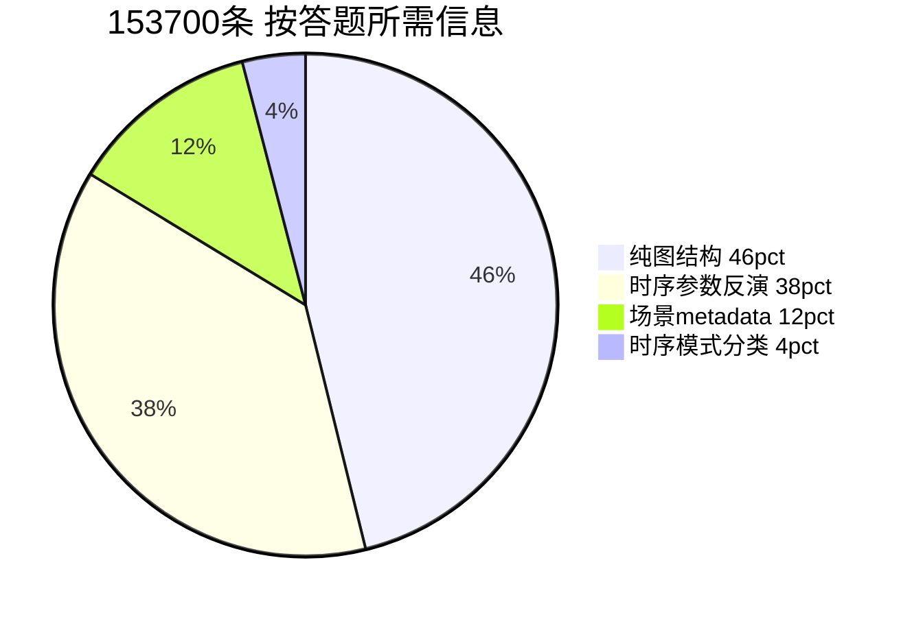

# 02 ST-Align 数据解剖

修改：2026-06-12  
数据：`data/ST-Bench/ST-Align/alignment_train.jsonl`（153,700 行 / 1,276,634,217 字节）  
统计产物：[artifacts/st_align_stats.json](artifacts/st_align_stats.json)（脚本 [analyze_st_align_questions.py](../../../tools/analyze_st_align_questions.py)）

---

## 1. 分类方法

按语义归入 14 类（`diffusion_shape` 全库仅 1 条，可忽略）。

每条样本还带有生成脚本写入的 `category` 字段；它与「能力组」大致对齐，但 **无法区分 temporal 内部的难易**（模式分类 vs 参数反演）。

---

## 2. 十四类问法：在问什么、占多少

| ID | 问题在问什么 | 条数 | 占比 | 答案形态 | 必须读 TS？ |
|----|--------------|------|------|----------|-------------|
| graph_direct | 两节点是否有向直连边 | 35,472 | 23.08% | yes/no | **否** |
| graph_indirect | 两节点是否存在间接路径 | 35,472 | 23.08% | yes/no | **否** |
| ts_sin_amp | 正弦振幅 A | 12,943 | 8.42% | 数值 | **是** |
| ts_sin_freq | 正弦频率 ω | 12,943 | 8.42% | 数值 | **是** |
| ts_sin_phase | 正弦相位 φ | 12,943 | 8.42% | 数值 | **是** |
| ts_drift_type | drift 演化模式名 | 6,227 | 4.05% | 类别 | **是** |
| ts_baseline | 长期 baseline | 6,227 | 4.05% | 数值 | **是** |
| ts_kappa | 均值回归速度 κ | 6,216 | 4.04% | 数值 | **是** |
| st_node_role | demand_source / propagation | 4,914 | 3.20% | 枚举 | 大多否 |
| st_edge_lag | 边传播 time lag | 4,837 | 3.15% | 整数 | 大多否 |
| ts_sigma | 噪声 σ | 4,616 | 3.00% | 数值 | **是** |
| st_edge_mod | 时变边 multiplier | 4,531 | 2.95% | 数值 | 大多否 |
| st_edge_effective | 有效耦合强度 | 4,531 | 2.95% | 数值 | 大多否 |
| ts_lambda | 节点耦合 λ | 1,827 | 1.19% | 数值 | **是** |

**正弦三参数合计**：38,829 条（**25.26%** 全库）——单一最大题型族。

### 2.1 典型问句与样例（来自 stats JSON）

**图结构（不需读 TS）**

- Q: `Is there a direct connection from node 0 to node 2?` → A: `yes`
- Q: `Is there an indirect path (through one or more intermediate nodes) from node 0 to node 1?` → A: `no`
- 依据：`Graph Structure: Node 0->Node 2; ...` 已明文列出全部有向边。

**时序参数反演（需读 TS）**

- Q: `What is the sinusoidal amplitude (A) of node 0 during the time range [0, 96]?` → A: `8.0`
- Q: `What is the mean reversion speed (kappa) of node 2 during the time range [0, 96]?` → A: `0.3`

**时序模式分类**

- Q: `What is the evolution pattern of node 0 during the time range [0, 96]?` → A: `sinusoidal` 或 `mean_reverting`

**时空 metadata**

- Q: `What is the type of node 2? demand_source or propagation?` → A: `propagation`
- Q: `What is the time lag between node 0 and node 2?` → A: `2`
- Q: `What is the modulation multiplier (multiplier) of edge (0,2) during the time range [40, 44]?` → A: `15`

---

## 3. 按「答题所需信息」聚合

| 能力组 | 含义 | 条数 | 占比 |
|--------|------|------|------|
| graph_text_only | 纯图结构 | 70,944 | **46.16%** |
| ts_numeric_inversion | 时序参数反演 | 57,716 | **37.55%** |
| scenario_metadata | 场景 metadata | 18,813 | **12.24%** |
| ts_pattern_classification | 时序模式分类 | 6,227 | **4.05%** |

**对 Stage 1 的含义**：近 **58%**（46% + 12%）的监督信号**不强制**模型从 `timeseries` 张量读答案；仅 **~42%** 真正要求读波形（37.55% + 4.05%）。

---

## 4. 与 `category` 字段对照

| category | 条数 | 占比 | 对应能力组 |
|----------|------|------|------------|
| spatial | 70,944 | 46.16% | graph_text_only |
| temporal | 63,943 | 41.60% | ts_numeric + ts_pattern |
| spatial_temporal | 18,813 | 12.24% | scenario_metadata |

`temporal`（41.6%）内部构成：

- 参数反演：57,715（占 temporal 的 **90.26%**）
- 模式分类：6,227（占 temporal 的 **9.74%**）

论文 Appendix 只提「Temporal Characters」，**不区分**「读波形反演参数」与「读波形认模式」——后者探针上明显更易（见 [04-探针交叉论证.md](04-探针交叉论证.md)）。

---

## 5. 答案分布：可猜性与先验风险

### 5.1 图结构 yes/no

| 题型 | yes | no |
|------|-----|-----|
| graph_direct | 14.22% | **85.78%** |
| graph_indirect | 30.38% | **69.62%** |

直连题 **no 占 86%**；模型若学「默认答 no」在直连题上仍有较高表面 accuracy，**不等于**读懂图或 TS。

### 5.2 时序模式（仅 2 类）

| 答案 | 条数 | 占 ts_drift_type |
|------|------|------------------|
| mean_reverting | 4,575 | 73.47% |
| sinusoidal | 1,652 | 26.53% |

### 5.3 时序数值题：答案多样性 vs 头部先验

| 题型 |  unique 答案数 | 头部先验（top-1 答案及占比） |
|------|----------------|------------------------------|
| ts_sin_amp | 107 | `40` 仅 5.42%（较分散） |
| ts_sin_freq | 53 | **`0.2618` 占 30.04%** |
| ts_sin_phase | 495 | **`-1.5708` 占 9.28%** |
| ts_baseline | 264 | `100` 占 11.27% |
| ts_kappa | **28** | **`0.3` 占 27.24%** |
| ts_sigma | 58 | `0.3` 占 14.77% |
| ts_lambda | 23 | `1.2` 占 20.91% |

**关键发现**：

- `kappa` 仅 28 种离散答案，top-1 占 27%——与探针 **2/5** 部分一致，存在「背表」空间。
- `frequency` top 为 `0.2618`（30%），探针失败常输出 **`0.0364`**（全库占 11.5%，非 top-1 但仍为高频）。
- `phase` top 为 **`-1.5708`（9.28%）**，与探针失败常输出的 **`-1.5708` 完全一致**——强烈暗示模型在学答案先验而非读序列。
- `baseline` top 含 `20.0`（3.21%），与探针 amplitude 常输出 `20.0` 数值重合，需警惕跨题型混淆。

### 5.4 时空 metadata：极低熵

| 题型 | unique 答案 | top-1 |
|------|-------------|-------|
| st_node_role | 2 | propagation 64.5% |
| st_edge_lag | **7** | **`1` 占 93.45%** |
| st_edge_mod | **5** | **`15` 占 59.57%** |
| st_edge_effective | **6** | **`1.5` 占 59.55%** |

这类题答案几乎由仿真剧本决定，**与波形无关**；模型可从问句模式 + 数据集先验猜中，不证明 TS 对齐。

---

## 6. 小结（供 Stage 1 决策）

1. **46% 图结构题**：Graph Structure 文本泄漏，对 `ts_encoder` 梯度贡献弱。
2. **25% 正弦反演**：任务难、占比高，与 Stage 1 探针 0/5 一致。
3. **12% metadata**：低熵、不需读 TS，易饱和。
4. **仅 ~4% 模式分类**相对可学，但体量太小，难以拉动整体 temporal。
5. 答案分布存在 **可背诵的高频常数**（尤其 phase `-1.5708`、freq 离散集合、kappa `0.3`），与探针「常数错答」现象一致。

下一篇：[03-样本形态与生成.md](03-样本形态与生成.md)
