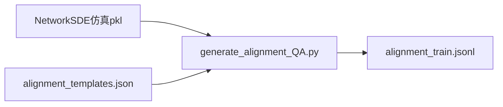

# 03 ST-Align 样本形态与生成逻辑

修改：2026-06-12  
统计：[artifacts/st_align_stats.json](artifacts/st_align_stats.json)

---

## 1. 字段与训练入口

| 字段 | 类型 | 用途 |
|------|------|------|
| `input` | string | 完整 prompt：专家前缀 + 多节点 `<ts><ts/>` + Graph Structure + 问句 |
| `timeseries` | `List[List[float]]` | 与 `<ts>` 占位一一对应；训练时经 processor 变为 patch embedding |
| `output` | string | 短答案（yes/no、枚举、数值字符串） |
| `category` | string | `spatial` / `temporal` / `spatial_temporal`（生成脚本标注） |

注册路径：`data/dataset_info.json` → `alignment` → Stage 1 脚本 `--dataset alignment`，模板 `STReasoner-Align`（见 [train_stage1.sh](../../../../scripts/qwen3-8b/train_stage1.sh)）。

**没有**：Options A–D、`<answer>` 包裹、CoT、forecasting 序列——与 ST-CoT / ST-Test **不同任务族**。

---

## 2. 统一输入前缀

所有 153,700 条共享同一骨架（[generate_alignment_QA.py](../../../../data_generation/generate_alignment_QA.py) `build_input_prefix`）：

```text
You are a spatial temporal analysis expert.
Node 0 time series with length of {L}: <ts><ts/>; Node 1 ... ;
Graph Structure: Node a->Node b; ... ;
please analyze the spatial temporal data and answer the following question:
{14 种问法之一}
```

**processor 约束**：`<ts><ts/>` 个数须与 `timeseries` 列表长度一致，否则样本丢弃（见 `processing_qwen3_ts.py` / supervised processor）。

---

## 3. 生成流水线（代码 → JSONL）



- 数据源：`data_generation/batch_output/task_*.pkl`（论文称 ~851 训练场景）
- 模板：[alignment_templates.json](../../../../data_generation/prompts/qa_generation/alignment_templates.json)
- 每场景按模板批量展开：
  - **spatial**：对每个有序 `(src,tgt)` 出 2 题（直连 + 间接）→ \(2N^2\)
  - **temporal**：每个 drift pattern 的每个参数字段 1 题；sinusoidal 额外 A/ω/φ 三题
  - **spatial_temporal**：\(N + E + 2M\)（节点角色 + 边 lag + 每 modulation 两题）

论文 Appendix J 与代码一致；**例外**：`diffusion_shape` 在模板中定义，全库 **仅生成 1 条**（见 stats 样例：10 节点、168 步的 outlier 场景）。

---

## 4. 模板 ↔ 问法 ID 映射

| 模板 key | 问法 ID | category |
|----------|---------|----------|
| edge_relationship | graph_direct | spatial |
| indirect_connection | graph_indirect | spatial |
| sinusoidal_A / _omega / _phi | ts_sin_amp / _freq / _phase | temporal |
| drift_type | ts_drift_type | temporal |
| baseline / kappa / sigma / lambda | ts_baseline / _kappa / _sigma / _lambda | temporal |
| node_type | st_node_role | spatial_temporal |
| edge_lag | st_edge_lag | spatial_temporal |
| edge_modulation / effective_coupling_strength | st_edge_mod / st_edge_effective | spatial_temporal |

---

## 5. 规模与冗余（全库统计）

### 5.1 场景与重复

| 指标 | 值 |
|------|-----|
| 指纹去重场景数 | **423** |
| 每场景题数 median | **310** |
| 每场景题数 mean | **363.4** |
| 每场景题数 range | 72 – 6,345 |
| 归一化 question stem 唯一数 | **19** |

**含义**：

- 153,700 / 423 ≈ 363 题/场景——同一 `timeseries` 张量与前缀重复数百次，**仅末句问法不同**。
- 全库只有 **19** 种 question stem（节点 id、时间窗、边端点参数化后）——模板化极强。
- 对 Stage 1 有效 batch：模型大量 step 在重复相同前缀下的不同短问句，**梯度高度冗余**。

### 5.2 图与时序结构

| 维度 | 分布要点 |
|------|----------|
| 节点数 | 10 节点 **52.9%**；5 节点 27.0%；3 节点 20.1% |
| 序列长度（node0） | 48 步 25.4%；168 步 23.4%；96 步 18.8%；其余分散 |
| 前缀字符数 | median **739**；mean 582（双模态：小图 ~430，大图 ~780） |
| 图边数（edge list 条数） | median **9**；mean 7.4 |

**注意**：早期分析常假设「5 节点 × 96 步」——在全库中仅为 **~27% × ~19%** 量级，**不能**用单一样本代表全体。

### 5.3 问句中的 time range

仅部分问句含 `during the time range [a, b]`（temporal 与 modulation 类）。全库 time_range 计数 **不等于** 153,700；常见窗包括 `[0, 96]`、`[0, 48]` 等，与节点序列长度相关但 **不一一对应**（modulation 题为短窗如 `[40, 44]`）。

---

## 6. 与 ST-Bench 四任务的区别

| 维度 | ST-Align | ST-Test / ST-CoT |
|------|----------|------------------|
| 任务 | 参数/结构短 QA | etiological / entity / correlation / forecasting |
| 答案 | 数值或 yes/no 或短词 | 单选字母或浮点序列 |
| 推理 | 无 CoT | Stage 2 起有 CoT / RL |
| 目的 | Stage 1 模态对齐 | Stage 2/3 推理与评测 |

Stage 1 学的是 **格式 + 短答案模板**；Stage 2 突然切换到 **长推理 + 四选一**——中间无过渡任务（见 [05-Stage1含义与建议.md](05-Stage1含义与建议.md)）。

---

## 7. 文件大小说明

| 路径 | 大小 | 说明 |
|------|------|------|
| `alignment_train.jsonl` | **~1.19 GB** | Stage 1 训练用 |
| `alignment_test.jsonl` | ~0.36 GB | 对齐测试 |
| `alignment.jsonl` | ~1.54 GB | train+test 合并 |
| `ST-Align/` 目录合计 | **~3.08 GB** | 含上述三文件 |

上一篇：[02-数据解剖.md](02-数据解剖.md) · 下一篇：[04-探针交叉论证.md](04-探针交叉论证.md)
