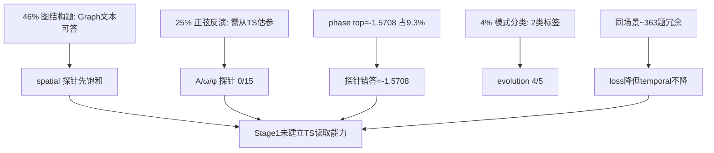

# 04 ST-Align 探针交叉论证

修改：2026-06-12  
探针来源：[17-服务器1旧策略-Stage 1 LoRA 分段训练经验（500→2000）.md](../17-服务器1旧策略-Stage%201%20LoRA%20分段训练经验（500→2000）.md)（**不重跑**）  
数据分布：[02-数据解剖.md](02-数据解剖.md)、[artifacts/st_align_stats.json](artifacts/st_align_stats.json)

---

## 1. 探针设定（必读限制）

| 项 | 说明 |
|----|------|
| 模型 | Qwen3-4B + LoRA rank 8，bf16，2000 step 终点 |
| 数据 | **训练集**上固定面板，非 ST-Test |
| 面板 | 30 条「健康」+ 40 条 temporal balanced（8 题型 × 5 条） |
| 结论边界 | 探针证明 **Stage 1 链路可训、但 temporal 数值未学会**；不能外推论文 8×A100 full FT |

---

## 2. 总览：loss 降了，temporal 不动

| 累计 step | train_loss | 30 条健康 | 40 条 temporal |
|-----------|------------|-----------|----------------|
| 500 | 3.86 | — | — |
| 1000 | 0.89 | 14/30 | — |
| 1500 | 0.52 | 16/30 | **6/40** |
| 2000 | **0.41** | 17/30 | **6/40** |

**1500→2000**：loss 仍降，30 条 +1，**temporal 仍为 6/40**——停训应看探针面板，不能看 loss 斜率。

---

## 3. 按题型：数据占比 ↔ 探针命中 ↔ 失败模式

| 问法 ID | 全库占比 | 40 条探针 | 2000 step 命中 | 数据侧提示 |
|---------|----------|-----------|----------------|------------|
| graph_direct / indirect | 各 23.08% | 健康面板含 spatial | **10/10**（报告 17） | 不需读 TS；no 先验 70–86% |
| st_node_role 等 metadata | 12.24% 合计 | 健康面板部分 | 较早饱和 | 答案熵极低（lag→1 占 93%） |
| ts_drift_type | 4.05% | 5 条 | **4/5** | 仅 2 类答案；mean_reverting 73% |
| ts_kappa | 4.04% | 5 条 | **2/5** | 仅 28 种答案；`0.3` 占 27% |
| ts_sin_amp | 8.42% | 5 条 | **0/5** | 107 种答案，探针常答 **`20.0`** |
| ts_sin_freq | 8.42% | 5 条 | **0/5** | top 答案 `0.2618`（30%）；探针常答 **`0.0364`**（非 top，全库第 3 为 `0.0654` 11.5%） |
| ts_sin_phase | 8.42% | 5 条 | **0/5** | top **`-1.5708`（9.28%）**；探针常答 **`-1.5708`** |
| ts_baseline | 4.05% | 5 条 | **0/5** | top `100`（11%）；与 amp 错答 `20.0` 不同 |
| ts_sigma | 3.00% | 5 条 | **0/5** | top `0.3`（15%） |
| ts_lambda | 1.19% | 5 条 | **0/5** | 样本最少 |

### 3.1 对齐关系（论证核心）

**易饱和题型 ↔ 低 TS 依赖**

- spatial yes/no 占 **46%**，探针 **最先满**——与「Graph Structure 文本即可答」一致。
- metadata 占 **12%**，枚举/低熵（lag=1 占 93%）——模型可背答案分布。

**难且占比高的题型 ↔ 探针全灭**

- 正弦 A/ω/φ 占 **25.26%**，探针 **0/15**（40 条里各 5 条）。
- 其余数值反演（baseline/sigma/lambda）同样 **0/5**。

**唯一部分成功的 temporal：模式分类**

- `ts_drift_type` 占 4.05%，探针 **4/5**——与全库仅 `mean_reverting` / `sinusoidal` 两类一致。
- 这是 temporal 子集里 **唯一** 与「读波形形态」相关且探针能部分学动的类型。

**kappa 中间态**

- 探针 2/5；答案仅 28 种离散值，top `0.3` 占 27%——介于「模式分类」与「连续反演」之间，符合 **可背离散表** 但难精读的直觉。

---

## 4. 失败模式：先验常数，非随机错

报告 17 记录 2000 step 探针典型错误：

| 题型 | 探针常输出 | 全库答案分布对照 |
|------|------------|------------------|
| amplitude | **`20.0`** | amp top 为 `40`（5.4%）；`20.0` 在 **baseline** 题占 3.2%——更像混答 baseline 先验 |
| frequency | **`0.0364`** | 非 freq top-3；全库 freq 第 3 为 `0.0654`（11.5%），top 为 `0.2618`（30%） |
| phase | **`-1.5708`** | **与全库 phase top-1 完全一致（9.28%）** |

**解读**：

1. **phase** 最像「背数据集先验」——错答等于最高频 gold 之一。
2. **frequency / amplitude** 像「记了一批常见常数」，未与输入 TS 绑定。
3. 错误 **非均匀随机**——排除「 merely 训练不足随机猜」的简单解释；更支持 **监督设计 + 答案分布** 驱动模型走捷径。

---

## 5. 训练覆盖 vs 任务难度

| 指标 | 值 |
|------|-----|
| 全库样本 | 153,700 |
| 2000 step × 有效 batch | LoRA 实验 ~1.64 sample/s × ~3.3h ≈ **2 万级** 样本曝光（粗算） |
| 相对全库 | **严重欠训**（报告 17 已指出） |

但 **1500→2000 temporal 6/40 不变**，说明对最难题型而言，**继续堆 step 边际收益趋零**——问题不仅是「看得少」，更是 **46% 样本不逼读 TS + 25% 极难反演** 的结构问题。

官方 Stage 1：**1000 step**（8×A100 full FT），与 LoRA 2000 step 不可直接比，但 **任务面板结构相同**——数据侧缺陷对任何配置都存在。

---

## 6. 交叉论证链（数据 → 探针）

---

## 7. 本节结论

1. **探针结果与数据分布逐项对齐**，不是「训练没调好」的单因素故事。
2. **loss ↓ + temporal 6/40 平台** 是 ST-Align 设计的可预期后果：大部分梯度不训练 TS 读取，最难题型又占近 **38%** 且探针全灭。
3. **不能** 用 spatial 探针满分证明 Stage 1 成功；**应** 用 temporal balanced 面板判断 TS 对齐是否成立——当前 **不成立**。

下一篇：[05-Stage1含义与建议.md](05-Stage1含义与建议.md)
