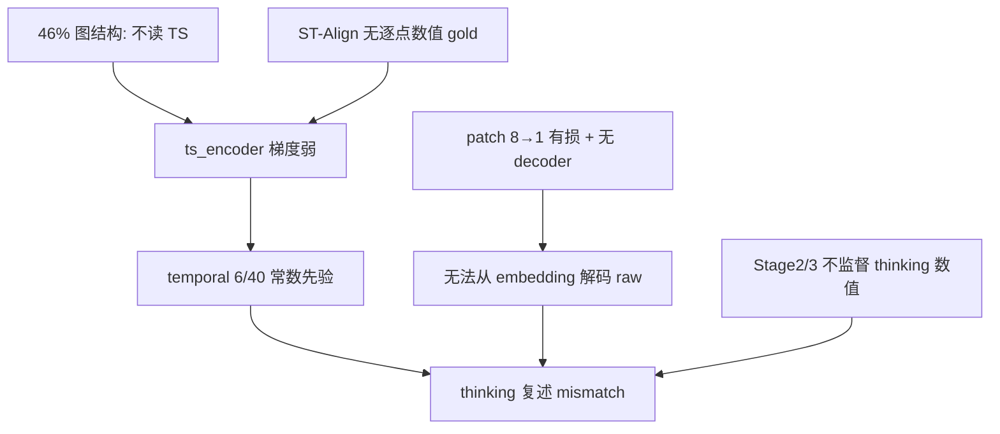

# 06 为何 Stage 1 训完仍无法复述时间序列

修改：2026-06-12  
前置：[02-数据解剖](02-数据解剖.md) · [04-探针交叉论证](04-探针交叉论证.md) · [05-Stage1含义与建议](05-Stage1含义与建议.md)  
延伸（全 pipeline）：[39-MLP复述四任务分析](../../39-MLP复述四任务分析.md) · [36-encoder代码细节](../../36-encoder代码细节.md)

---

## 0. 结论先行

「复述时间序列」指：模型在输出中写出 `Node k [a-b]: 425.44, 415.47, ...` 这类**逐点数值**，且与 JSONL 里 raw `timeseries` 对齐。

Stage 1（ST-Align）训完后做不到，**甚至官方 STReasoner-8B 三阶段训完也大量做不到**——主因是 **任务从未教复述、架构也不支持可逆解码**，不是单纯「步数不够」或 LoRA 规模问题。ST-Align 的数据结构（46% 不逼读 TS、temporal 探针 6/40）使 **`ts_encoder` 在 Stage 1 几乎学不到「从 embedding 读回数值」**，与复述失败是同一根因的不同表现。

---

## 1. 输入里没有明文时序

prompt 只有 `<ts><ts/>` 占位符；真实序列经 `sp_encoding` → 5 层 MLP `TimeSeriesEmbedding`（`patch_size=8`），每 8 个有效点压成 **1 个 patch embedding**，再与 token embedding 合并进 LLM。

| 环节 | 事实 | 对复述的含义 |
|------|------|--------------|
| 文本侧 | 题干/Graph Structure 可见；**raw 数值不在 prompt 明文里** | 模型不能「抄题干」复述 |
| 编码侧 | `[value, mask]` → patch → 2560/4096 维向量 | 有损压缩，无配套 decoder |
| 监督侧 | gold 是 yes/no、类别、SDE 参数等 | **从未监督「解码 embedding → 数值列表」** |

代码依据见 [36-encoder代码细节](../../36-encoder代码细节.md)、[07_time_series_encoder.md](../../../guides/streasoner_code_reading/07_time_series_encoder.md)。

---

## 2. ST-Align 更不教复述

全库 153,700 条（[02-数据解剖](02-数据解剖.md)）：

| 能力组 | 占比 | 与复述的关系 |
|--------|------|--------------|
| 纯图结构 | 46.16% | 不看 TS；`ts_encoder` 梯度被稀释 |
| 场景 metadata | 12.24% | 答案来自仿真设定，非逐点读波形 |
| 时序参数反演 | 37.55% | 要 A/ω/φ/κ 等**抽象参数**，非 `[v1,v2,...]` |
| 时序模式分类 | 4.05% | 要 `mean_reverting` / `sinusoidal` 标签 |

**没有任何一题**要求「输出某 node 某 time range 的 raw 数值列表」。Stage 1 LoRA 2000 step 探针（[04-探针交叉论证](04-探针交叉论证.md)、[17 报告](../17-服务器1旧策略-Stage%201%20LoRA%20分段训练经验（500→2000）.md)）：

- temporal balanced **6/40**（1500 起平台）；
- A/ω/φ **0/15**，常答 `-1.5708`、`20.0`、`0.0364` 等**数据集先验常数**；
- 说明 `ts_encoder` 未建立「读序列 → 输出与输入绑定的数」的通路——复述是更严的要求，Stage 1 更不可能自发学会。

---

## 3. 全 pipeline 也不监督 thinking 复述

Stage 2/3 评测只看 `<answer>`（选项或预测向量）；thinking 里的数值复述**不进 loss**。

[39-MLP复述四任务分析](../../39-MLP复述四任务分析.md) 对 **已训完的三阶段 STReasoner-8B** 在 ST-Test 6144 上统计（strict 口径：`max_abs_diff > 0.01` 记 mismatch）：

| 任务 | 至少一个复述窗口对不上的样本 |
|------|------------------------------|
| forecasting | **141/280** |
| correlation | **347/1592** |
| entity / etiological | 严格数值列表口径下 **0**（多为定性描述，非「无问题」） |

典型失败：thinking 里写出 `[1550.0, 188.64, ...]`、`370.20` 平线等，与 raw 差几个数量级——与 Stage 1 探针的**常数先验**同类，都是「像数字、未绑定 embedding」。

**不能**从「复述错 ⇒ 最终答案必错」简单推断（39 报告：forecasting mismatch 组 MAE 有时更低；correlation mismatch 组 accuracy 有时更高）。但 **能** 说明：**三阶段结束仍未建立稳定的 embedding→逐点数值映射**。

---

## 4. 信息瓶颈与归一化

| 因素 | 说明 |
|------|------|
| Patch 压缩 | 8 点 → 1 embedding，设计上为下游推理服务，非可逆存储 |
| `sp_encoding` | 全序列 mean-center；\|x\|≥3 时按 max 缩放到约 [-3,3] | 模型内部尺度与「复述 raw 原值」不一致 |
| 无 decoder | 要从 embedding **反演**原尺度逐点值，既非设计目标，也无 loss |

因此「复述」比 ST-Align 里的参数反演（A/ω/φ）**更难**——后者已是探针 0/5，前者更无监督。

---

## 5. 与 Stage 1 分析链的衔接

- [04](04-探针交叉论证.md)：Stage 1 **不读 TS 也能降 loss** ↔ temporal 平台。
- 本篇：同一机制下，**复述**（比参数反演更严）**必然失败**。
- [05](05-Stage1含义与建议.md)：停训看 temporal 面板，勿用 spatial/loss 代替 TS 能力验收。

---

## 6. 应如何验证「有没有读 TS」

| 不建议 | 建议 |
|--------|------|
| 用 spatial 10/10 或 train_loss 证明 Stage 1 成功 | **专用复述 probe**：固定 sample idx + node + window，只问「输出 raw 数值列表」 |
| 假设堆 Stage 1 step 会自然学会复述 | 与 [39](../../39-MLP复述四任务分析.md) 口径对齐，比较 0-based/1-based 窗口 |
| 把 thinking 复述错直接等同任务失败 | 分任务看：forecasting 复述与预测常同现；correlation 可复述错但选项对 |

Stage 1 更现实的合格线（见 [05](05-Stage1含义与建议.md)）：格式正确 + evolution/kappa 部分可读 + **不**宣称 temporal 数值反演或复述已成立。

---

## 7. 一句话收束

Pipeline 教的是「用 embedding 做图结构判断 / 参数猜测 / 四选一推理」，**从未教「把 `<ts>` 里的波形按点念出来」**；ST-Align 又大半不逼读 TS，故 Stage 1 训完连复述都做不到是**结构上的预期后果**，不是偶然 bug。

返回索引：[01-索引.md](01-索引.md)
