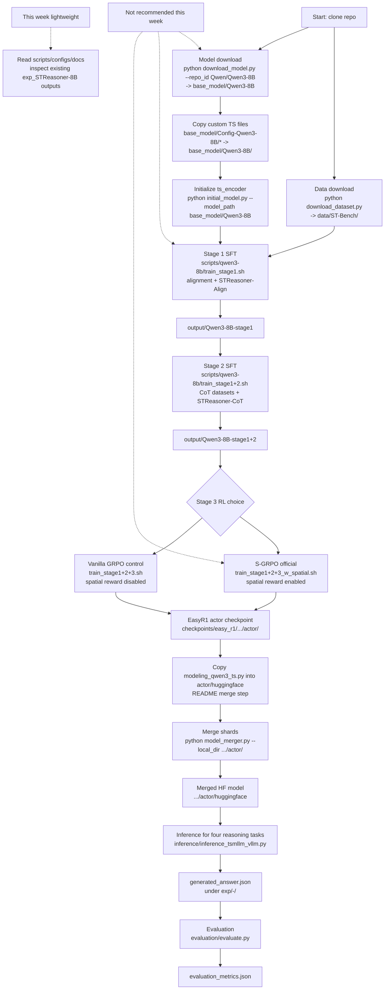

# 02 官方 Pipeline 复原

> 证据标记说明：
> `已从代码确认` 表示结论直接来自 README、Python 脚本或 shell 脚本。
> `合理推测` 表示根据命名和参数关系推断，但未运行验证。
> `尚未确认` 表示需要下载数据、模型或实际训练日志后才能确认。

## 1. 总流程

`已从代码确认`：README 把 STReasoner 训练定义为三阶段 pipeline：Stage 1 是 time series alignment SFT，Stage 2 是 cold-start reasoning SFT，Stage 3 是 S-GRPO RL，见 `README.md:44-50`。README 的官方示例主线使用 Qwen3-8B，见 `README.md:90-100` 和 `README.md:123-137`。

| 顺序 | 阶段 | 官方命令 / 脚本 | 输入 | 输出 | 本周是否必须跑 | 不跑会损失什么理解 |
|---:|---|---|---|---|---|---|
| 1 | 数据下载 | `python download_dataset.py`，README 见 `README.md:76-82` | HuggingFace dataset `Time-HD-Anonymous/ST-Bench`，见 `download_dataset.py:17-21` | `data/ST-Bench/`，见 `download_dataset.py:12-24` | 不必须 | 看不到真实 JSONL 样例，尤其是 `input`、`output`、`timeseries` 和 `Graph Structure` 的实际格式。 |
| 2 | 模型下载 | `python download_model.py --repo_id Qwen/Qwen3-8B`，README 见 `README.md:90-91` | HuggingFace model repo，默认 `Qwen/Qwen3-8B`，见 `download_model.py:4-12` | 默认 `base_model/Qwen3-8B`，见 `download_model.py:10-13` | 不建议 | 不能查看完整权重目录和 tokenizer 实际文件，但代码结构阅读不依赖权重。 |
| 3 | 拷贝自定义模型代码 | `cp -rf base_model/Config-Qwen3-8B/* base_model/Qwen3-8B/`，见 `README.md:92` | 下载后的 Qwen3-8B 目录和 `base_model/Config-Qwen3-8B/` | 带 `modeling_qwen3_ts.py`、`processing_qwen3_ts.py`、`configuration_qwen3_ts.py` 的本地模型目录 | 不建议 | 不能验证 HuggingFace `trust_remote_code=True` 是否正确加载自定义 TS 模型。 |
| 4 | 初始化模型 | `python initial_model.py --model_path base_model/Qwen3-8B`，见 `README.md:93` | `base_model/Qwen3-8B` | 原地保存初始化后的模型和 processor，见 `initial_model.py:65-81` | 不建议 | 不能确认 `ts_encoder` 初始化后的实际权重和保存结果。 |
| 5 | Stage 1 SFT | `bash scripts/qwen3-8b/train_stage1.sh`，见 `README.md:99` | `base_model/Qwen3-8B`、dataset `alignment`、template `STReasoner-Align`，见 `scripts/qwen3-8b/train_stage1.sh:4-11` | `output/Qwen3-8B-stage1`，见 `scripts/qwen3-8b/train_stage1.sh:11` | 不建议 | 缺少 alignment SFT 训练日志、loss 曲线和 checkpoint。 |
| 6 | Stage 2 SFT | `bash scripts/qwen3-8b/train_stage1+2.sh`，见 `README.md:100` | `output/Qwen3-8B-stage1`、四类 CoT 数据、template `STReasoner-CoT`，见 `scripts/qwen3-8b/train_stage1+2.sh:4-11` | `output/Qwen3-8B-stage1+2`，见 `scripts/qwen3-8b/train_stage1+2.sh:11` | 不建议 | 缺少 cold-start reasoning SFT checkpoint，后续 RL 官方主线无法从本地接上。 |
| 7 | Stage 3 RL / S-GRPO | `bash scripts/qwen3-8b/train_stage1+2+3_w_spatial.sh`，见 `README.md:123-124` | `output/Qwen3-8B-stage1+2`、ST-RL 四任务、ST-Test 四任务、reward function，见 `scripts/qwen3-8b/train_stage1+2+3_w_spatial.sh:5-23` | `checkpoints/easy_r1/qwen3_8b_grpo_stage1+2+3_w_spatial/...`，路径模式见 `README.md:133-137` | 不建议 | 不能观察 rollout、reward、spatial reward、GRPO advantage 和最终 RL checkpoint。 |
| 8 | checkpoint merge | 先复制 `modeling_qwen3_ts.py`，再运行 `python model_merger.py --local_dir ...`，见 `README.md:130-137` | EasyR1 actor shard checkpoint 目录，包含 `model_world_size_*_rank_*.pt`，见 `model_merger.py:60-74` | `actor/huggingface/` 下合并后的 HuggingFace 权重，见 `model_merger.py:161-182` | 不建议 | 不能验证分片权重合并和最终推理目录结构。 |
| 9 | inference | `python inference/inference_tsmllm_vllm.py --task ... --model_path ...`，见 `README.md:142-156` | 合并后的 `actor/huggingface` 模型和 ST-Test 数据 | `exp/<task>-<model>/generated_answer.json`，输出逻辑见 `inference/inference_tsmllm_vllm.py:264-322` | 不建议 | 不能生成自己的预测文件，只能阅读已有示例输出。 |
| 10 | evaluation | `python evaluation/evaluate.py --task ... --exp_path ...`，见 `README.md:161-170` | `exp/<task>-<model>/generated_answer.json` 和测试集 | `evaluation_metrics.json`，见 `evaluation/evaluate.py:160-174` | 轻量但依赖测试集 | 如果不跑，不能验证本机 metrics 复现；但可通过代码阅读理解指标。 |

`已从代码确认`：SFT 阶段依赖 `deepspeed --num_gpus 8` 和 `ds_config/ds_config_3.json`，见 `scripts/qwen3-8b/train_stage1.sh:1-2`。RL 阶段依赖 EasyR1/Verl 环境，README 要求 Docker 镜像 `hiyouga/verl:ngc-th2.8.0-cu12.9-vllm0.11.0`，见 `README.md:68-72` 和 `README.md:108-116`。

`合理推测`：如果本周目标是组会代码阅读，不完整跑 pipeline 仍然可以讲清结构；真正损失的是真实数据样例、训练日志、checkpoint 文件布局和指标复现。

## 2. 脚本清单

### 2.1 官方主线脚本

| 脚本路径 | 执行阶段 | 输入 | 输出 | 依赖路径 | 是否本周必须跑 | 不跑会损失什么理解 |
|---|---|---|---|---|---|---|
| `download_dataset.py` | 数据下载 | `Time-HD-Anonymous/ST-Bench` | `data/ST-Bench/` | `huggingface_hub.snapshot_download`，见 `download_dataset.py:8-21` | 不必须 | 真实样例格式不能验证。 |
| `download_model.py` | 模型下载 | `--repo_id`，默认 `Qwen/Qwen3-8B` | 默认 `base_model/<repo_name>` | HuggingFace Hub，见 `download_model.py:4-12` | 不建议 | 不能验证本地权重目录。 |
| `initial_model.py` | 模型初始化 | `--model_path base_model/Qwen3-8B` | 原地保存初始化模型 | `AutoModelForCausalLM.from_pretrained(... trust_remote_code=True)`，见 `initial_model.py:54-70` | 不建议 | 不能验证 `ts_encoder` 初始化效果。 |
| `scripts/qwen3-8b/train_stage1.sh` | Stage 1 SFT / alignment | `base_model/Qwen3-8B`、dataset `alignment` | `output/Qwen3-8B-stage1` | `src/train.py`、`ds_config/ds_config_3.json`、template `STReasoner-Align`，见 `scripts/qwen3-8b/train_stage1.sh:1-11` | 不建议 | 缺少 alignment 训练日志。 |
| `scripts/qwen3-8b/train_stage1+2.sh` | Stage 2 SFT / CoT | `output/Qwen3-8B-stage1`、`entity_cot,etiological_cot,correlation_cot,forecasting_cot` | `output/Qwen3-8B-stage1+2` | `src/train.py`、template `STReasoner-CoT`，见 `scripts/qwen3-8b/train_stage1+2.sh:1-11` | 不建议 | 缺少 CoT SFT 训练日志和 checkpoint。 |
| `scripts/qwen3-8b/train_stage1+2+3_w_spatial.sh` | Stage 3 S-GRPO | `output/Qwen3-8B-stage1+2`、ST-RL 四任务 | EasyR1 checkpoint，实验名 `qwen3_8b_grpo_stage1+2+3_w_spatial` | `src/EasyR1/examples/config.yaml`、`str.py:compute_score`、ST-RL/ST-Test，见 `scripts/qwen3-8b/train_stage1+2+3_w_spatial.sh:7-31` | 不建议 | 缺少 spatial reward 和 RL 动态理解。 |
| `scripts/qwen3-8b/train_stage1+2+3.sh` | Stage 3 vanilla GRPO 对照 | `output/Qwen3-8B-stage1+2`、ST-RL 四任务 | EasyR1 checkpoint，实验名 `qwen3_8b_grpo_stage1+2+3` | 同 S-GRPO，但无 spatial reward 开关，见 `scripts/qwen3-8b/train_stage1+2+3.sh:7-28` | 不建议 | 缺少 vanilla GRPO 对照训练结果。 |
| `model_merger.py` | checkpoint merge | EasyR1 actor shard checkpoint 目录 | `actor/huggingface/` 合并模型 | `model_world_size_*_rank_*.pt`、`AutoConfig.from_pretrained(hf_path)`，见 `model_merger.py:60-182` | 不建议 | 不能验证 RL checkpoint 到 HF 推理目录的转换。 |
| `inference/inference_tsmllm_vllm.py` | 推理 | `--task`、`--model_path` | `exp/<task>-<model>/generated_answer.json` | vLLM TS engine、ST-Test 数据，见 `inference/inference_tsmllm_vllm.py:42-61` 和 `inference/inference_tsmllm_vllm.py:296-322` | 不建议 | 不能生成自己的预测文件。 |
| `evaluation/evaluate.py` | 评估 | `--task`、`--exp_path`、测试集 | `evaluation_metrics.json` | `evaluation/evaluate_qa.py`，见 `evaluation/evaluate.py:100-174` | 可轻量尝试但依赖数据 | 不能验证指标计算与已有输出是否匹配。 |

### 2.2 `scripts/` 目录变体清单

`已从代码确认`：`scripts/` 下共有 Qwen3-8B、Qwen3-14B、Qwen3-4B-Instruct-2507 和 Qwen3-VL-8B-Instruct 四组训练脚本。下表按功能压缩展示每个脚本。

| 脚本路径 | 阶段 | 主要输入 | 主要输出 / 实验名 | 是否 spatial | 本周建议 |
|---|---|---|---|---:|---|
| `scripts/qwen3-8b/train_stage1.sh` | SFT Stage 1 | `base_model/Qwen3-8B`, `alignment` | `output/Qwen3-8B-stage1` | 否 | 不跑，读参数 |
| `scripts/qwen3-8b/train_stage1+2.sh` | SFT Stage 1+2 | `output/Qwen3-8B-stage1`, 四类 CoT | `output/Qwen3-8B-stage1+2` | 否 | 不跑，读参数 |
| `scripts/qwen3-8b/train_stage2.sh` | SFT Stage 2 only | `base_model/Qwen3-8B`, 四类 CoT | `output/Qwen3-8B-stage2` | 否 | 不跑，作为 ablation 入口阅读 |
| `scripts/qwen3-8b/train_stage2_only_text.sh` | SFT text-only | `base_model_for_inference/Qwen3-8B`, 四类 `_text` CoT | `output/Qwen3-8B-stage2-only-text` | 否 | 不跑，作为 text ablation 入口阅读 |
| `scripts/qwen3-8b/train_stage1+2+3.sh` | RL vanilla GRPO | `output/Qwen3-8B-stage1+2`, ST-RL | `qwen3_8b_grpo_stage1+2+3` | 否 | 不跑，读作 S-GRPO 对照 |
| `scripts/qwen3-8b/train_stage1+2+3_w_spatial.sh` | RL S-GRPO official | `output/Qwen3-8B-stage1+2`, ST-RL | `qwen3_8b_grpo_stage1+2+3_w_spatial` | 是 | 不跑，重点阅读 |
| `scripts/qwen3-8b/train_stage1+3_w_spatial.sh` | RL after Stage 1 | `output/Qwen3-8B-stage1`, ST-RL | `qwen3_8b_grpo_stage1+3_w_spatial` | 是 | 不跑，作为 ablation 入口阅读 |
| `scripts/qwen3-8b/train_stage2+3_w_spatial.sh` | RL after Stage 2 only | `output/Qwen3-8B-stage2`, ST-RL | `qwen3_8b_grpo_stage2+3_w_spatial` | 是 | 不跑，作为 ablation 入口阅读 |
| `scripts/qwen3-8b/train_stage2+3_w_spatial_only_text.sh` | RL text-only | `output/Qwen3-8B-stage2-only-text`, ST-RL-text | `qwen3_8b_grpo_stage2+3_w_spatial_only_text` | 是 | 不跑，作为 text ablation 入口阅读 |
| `scripts/qwen3-8b/train_stage3.sh` | RL debug / from base | `base_model/Qwen3-8B`, ST-RL | `qwen3_8b_str_grpo_stage3_debug` | 否 | 不跑，非 README 主线 |
| `scripts/qwen3-8b/train_stage3_w_spatial.sh` | RL from base spatial | `base_model/Qwen3-8B`, ST-RL | `qwen3_8b_grpo_stage3_w_spatial` | 是 | 不跑，非 README 主线 |
| `scripts/qwen3-14b/train_stage1.sh` | SFT Stage 1 | `base_model/Qwen3-14B`, `alignment` | `output/Qwen3-14B-stage1` | 否 | 不跑，14B 变体 |
| `scripts/qwen3-14b/train_stage1+2.sh` | SFT Stage 1+2 | `output/Qwen3-14B-stage1`, 四类 CoT | `output/Qwen3-14B-stage1+2` | 否 | 不跑，14B 变体 |
| `scripts/qwen3-14b/train_stage2.sh` | SFT Stage 2 only | `base_model/Qwen3-14B`, 四类 CoT | `output/Qwen3-14B-stage2` | 否 | 不跑，14B 变体 |
| `scripts/qwen3-14b/train_stage2_only_text.sh` | SFT text-only | `base_model_for_inference/Qwen3-14B`, 四类 `_text` CoT | `output/Qwen3-14B-stage2-only-text` | 否 | 不跑，14B text 变体 |
| `scripts/qwen3-14b/train_stage1+2+3.sh` | RL vanilla GRPO | `output/Qwen3-14B-stage1+2`, ST-RL | `qwen3_14B_grpo_stage1+2+3` | 否 | 不跑，14B 对照 |
| `scripts/qwen3-14b/train_stage1+2+3_w_spatial.sh` | RL S-GRPO | `output/Qwen3-14B-stage1+2`, ST-RL | `qwen3_14B_grpo_stage1+2+3_w_spatial` | 是 | 不跑，14B 变体 |
| `scripts/qwen3-14b/train_stage1+3_w_spatial.sh` | RL after Stage 1 | `output/Qwen3-14B-stage1`, ST-RL | `qwen3_14B_grpo_stage1+3_w_spatial` | 是 | 不跑，14B ablation |
| `scripts/qwen3-14b/train_stage2+3_w_spatial.sh` | RL after Stage 2 | `output/Qwen3-14B-stage2`, ST-RL | `qwen3_14B_grpo_stage2+3_w_spatial` | 是 | 不跑，14B ablation |
| `scripts/qwen3-14b/train_stage2+3_w_spatial_only_text.sh` | RL text-only | `output/Qwen3-14B-stage2-only-text`, ST-RL-text | `qwen3_14B_grpo_stage2+3_w_spatial_only_text` | 是 | 不跑，14B text ablation |
| `scripts/qwen3-14b/train_stage3.sh` | RL debug / from base | `base_model/Qwen3-14B`, ST-RL | `qwen3_14B_str_grpo_stage3_debug` | 否 | 不跑，非 README 主线 |
| `scripts/qwen3-14b/train_stage3_w_spatial.sh` | RL from base spatial | `base_model/Qwen3-14B`, ST-RL | `qwen3_14B_grpo_stage3_w_spatial` | 是 | 不跑，非 README 主线 |
| `scripts/qwen3-4b-instruct/train_stage1.sh` | SFT Stage 1 | `base_model/Qwen3-4B-Instruct-2507`, `alignment` | `output/Qwen3-4B-Instruct-2507-stage1` | 否 | 不跑，4B 变体 |
| `scripts/qwen3-4b-instruct/train_stage1+2.sh` | SFT Stage 1+2 | `output/Qwen3-4B-Instruct-2507-stage1`, 四类 CoT | `output/Qwen3-4B-Instruct-2507-stage1+2` | 否 | 不跑，4B 变体 |
| `scripts/qwen3-4b-instruct/train_stage2.sh` | SFT Stage 2 only | `base_model/Qwen3-4B-Instruct-2507`, 四类 CoT | `output/Qwen3-4B-Instruct-2507-stage2` | 否 | 不跑，4B 变体 |
| `scripts/qwen3-4b-instruct/train_stage1+2+3_w_spatial.sh` | RL S-GRPO | `output/Qwen3-4B-Instruct-2507-stage1+2`, ST-RL | `Qwen3-4B-Instruct-2507_grpo_stage1+2+3_w_spatial` | 是 | 不跑，4B 变体 |
| `scripts/qwen3-4b-instruct/train_stage1+2+3.sh` | RL vanilla/debug | `output/Qwen3-8B-stage1+2`, ST-RL | `qwen3_8b_str_grpo_stage1+2+3_debug` | 否 | 不跑；路径名与目录名不一致，需后续确认 |
| `scripts/qwen3-4b-instruct/train_stage3.sh` | RL debug / from base | `base_model/Qwen3-8B`, ST-RL | `qwen3_8b_str_grpo_stage3_debug` | 否 | 不跑；路径名与目录名不一致，需后续确认 |
| `scripts/qwen3-vl-8b-instruct/train_stage2_only_image.sh` | SFT image-only | `base_model_for_inference/Qwen3-VL-8B-Instruct`, 四类 `_image` CoT | `output/Qwen3-VL-8B-Instruct-stage2-only-image` | 否 | 不跑，image ablation |
| `scripts/qwen3-vl-8b-instruct/train_stage2+3_w_spatial_only_image.sh` | RL image-only S-GRPO | `output/Qwen3-VL-8B-Instruct-stage2-only-image`, ST-RL-image | `qwen3_8b_grpo_stage2+3_w_spatial_only_image` | 是 | 不跑，image ablation |

`尚未确认`：`scripts/qwen3-4b-instruct/train_stage1+2+3.sh` 和 `scripts/qwen3-4b-instruct/train_stage3.sh` 的 `MODEL_PATH` 指向 Qwen3-8B，见抽取结果和文件名不一致；需要后续确认它们是否为 debug 脚本残留，再决定是否用于复现。

## 3. 输入输出表

| 阶段 | 输入路径 / 参数 | 关键依赖 | 输出路径 / 文件 | 证据 |
|---|---|---|---|---|
| 数据下载 | `repo_id="Time-HD-Anonymous/ST-Bench"`, `repo_type="dataset"` | 网络、HuggingFace Hub | `data/ST-Bench/` | `download_dataset.py:12-24` |
| 模型下载 | `--repo_id Qwen/Qwen3-8B` | 网络、HuggingFace Hub | `base_model/Qwen3-8B` | `download_model.py:4-13`, `README.md:90-91` |
| 拷贝自定义模型代码 | `base_model/Config-Qwen3-8B/*` | 本仓库 `configuration/modeling/processing` 文件 | `base_model/Qwen3-8B/` 内覆盖/新增自定义代码 | `README.md:92` |
| 初始化 TS encoder | `base_model/Qwen3-8B` | `trust_remote_code=True`, `AutoModelForCausalLM` | 原地保存模型和 processor | `initial_model.py:54-78` |
| Stage 1 SFT | `base_model/Qwen3-8B`, dataset `alignment` | `deepspeed`, `src/train.py`, `ds_config/ds_config_3.json`, `STReasoner-Align` | `output/Qwen3-8B-stage1` | `scripts/qwen3-8b/train_stage1.sh:1-29` |
| Stage 2 SFT | `output/Qwen3-8B-stage1`, datasets `entity_cot,etiological_cot,correlation_cot,forecasting_cot` | `deepspeed`, `src/train.py`, `STReasoner-CoT` | `output/Qwen3-8B-stage1+2` | `scripts/qwen3-8b/train_stage1+2.sh:1-29` |
| Stage 3 S-GRPO | `output/Qwen3-8B-stage1+2`, ST-RL 四任务 | EasyR1 config, `str.py:compute_score`, 8 GPU, spatial flags | EasyR1 checkpoint under experiment `qwen3_8b_grpo_stage1+2+3_w_spatial` | `scripts/qwen3-8b/train_stage1+2+3_w_spatial.sh:5-31` |
| Merge checkpoint | `checkpoints/easy_r1/.../global_step_51/actor/` | actor shards `model_world_size_*_rank_*.pt`, `actor/huggingface` config | `actor/huggingface/` merged model | `README.md:130-137`, `model_merger.py:60-182` |
| Inference | `--task reasoning_*`, merged model path | vLLM TS engine, ST-Test datasets | `exp/<task>-<model>/generated_answer.json` | `README.md:152-156`, `inference/inference_tsmllm_vllm.py:218-322` |
| Evaluation | `--task reasoning_*`, `--exp_path exp/...` | `evaluation/evaluate_qa.py`, test dataset | `exp/.../evaluation_metrics.json` | `README.md:166-170`, `evaluation/evaluate.py:160-174` |

## 4. Mermaid 流程图

## 5. 本周可执行 / 不建议执行

### 本周轻量可做

| 操作 | 原因 | 风险 |
|---|---|---|
| 阅读 `README.md`、`download_*.py`、`initial_model.py`、`model_merger.py` 和 `scripts/` | 能复原官方 pipeline，不需要 GPU 和权重。 | 无核心代码修改风险。 |
| 阅读 `data/dataset_info.json` | 能知道官方数据 split 和字段映射。 | 看不到真实样例内容。 |
| 阅读 `exp_STReasoner-8B/*/generated_answer.json` 和 `evaluation_metrics.json` | 能了解输出文件格式和已有结果结构。 | 不等于本机复现。 |
| 静态检查脚本参数 | 能讲清 Stage 1/2/3 的输入、输出、模板、reward function 和 spatial 开关。 | 不能验证脚本是否端到端可运行。 |

### 本周不建议执行

| 操作 | 不建议原因 | 如果强行不跑，损失 |
|---|---|---|
| `python download_model.py --repo_id Qwen/Qwen3-8B` | 下载大模型，耗时耗空间；原始任务要求不要下载大模型。 | 不能验证权重目录结构和 `trust_remote_code` 加载。 |
| `python initial_model.py --model_path base_model/Qwen3-8B` | 需要本地大模型，强依赖 GPU/内存资源，并会原地写模型目录。 | 不能验证 `ts_encoder` 初始化权重。 |
| `bash scripts/qwen3-8b/train_stage1.sh` 和 `train_stage1+2.sh` | DeepSpeed + 8 GPU SFT，重型训练。README 硬件要求是 8 张 A100 80GB，见 `README.md:54-72`。 | 缺少 SFT loss、checkpoint 和训练日志。 |
| `bash scripts/qwen3-8b/train_stage1+2+3_w_spatial.sh` | EasyR1/Verl RL，重型 rollout 和 actor update。 | 缺少 spatial reward 训练动态和 RL checkpoint。 |
| `python model_merger.py --local_dir ...` | 需要真实 RL actor shard checkpoint；会写 `actor/huggingface`。 | 不能验证 checkpoint merge。 |
| `python inference/inference_tsmllm_vllm.py ...` | 需要合并后的模型、vLLM、GPU 和完整测试数据。 | 不能生成自己的预测文件。 |

`已从代码确认`：如果只做代码阅读，最值得讲的是“脚本参数连接了 pipeline”：SFT 脚本用 LLaMA-Factory 的 `src/train.py`，RL 脚本用 EasyR1 的 `src.EasyR1.verl.trainer.main`，推理脚本用 vLLM TS engine，评估脚本读 `generated_answer.json` 生成 metrics。

## 6. 组会可讲版本

`已从代码确认`：官方 pipeline 可以复原为十步：下载 ST-Bench，下载 Qwen3-8B，把仓库里的 Qwen3-TS 自定义代码复制进模型目录，初始化 `ts_encoder`，跑 Stage 1 alignment SFT，跑 Stage 2 CoT SFT，进入 EasyR1/Verl 环境跑 Stage 3 S-GRPO，合并 EasyR1 actor checkpoint，跑 vLLM 时间序列推理，最后用 `evaluation/evaluate.py` 评估四类 reasoning 任务。

`已从代码确认`：Stage 1 和 Stage 2 都是 `deepspeed ... src/train.py --stage sft`，差别在数据和模板：Stage 1 使用 `alignment` + `STReasoner-Align`，Stage 2 使用四类 `*_cot` 数据 + `STReasoner-CoT`。Stage 3 改用 `python3 -m src.EasyR1.verl.trainer.main`，输入四类 ST-RL 数据，reward function 是 `src/EasyR1/examples/reward_function/str.py:compute_score`，官方 S-GRPO 版额外打开 `algorithm.enable_spatial_reward=true`、`algorithm.spatial_reward_weight=0.1` 和 `data.enable_spatial_reward=true`。

`合理推测`：本周不跑完整训练仍然可以真实汇报 pipeline 和代码证据；不足之处是无法展示自己的 loss 曲线、reward 曲线、checkpoint merge 结果和本机评估指标。因此组会表述应限定为“已完成官方 pipeline 静态复原和脚本级数据流定位，尚未进行重型训练复现”。

### 后续需要验证的问题

1. `尚未确认`：下载小样本或完整 ST-Bench 后，核对 `data/ST-Bench/ST-RL/*.jsonl` 中 `Graph Structure` 和 `timeseries` 的真实字段格式。
2. `尚未确认`：获得官方或本地 RL checkpoint 后，验证 `model_merger.py` 对 `model_world_size_*_rank_*.pt` 的合并结果是否可被 `inference_tsmllm_vllm.py` 加载。
3. `尚未确认`：确认 `scripts/qwen3-4b-instruct/train_stage1+2+3.sh` 和 `train_stage3.sh` 中指向 Qwen3-8B 的路径是否为 debug 残留。
