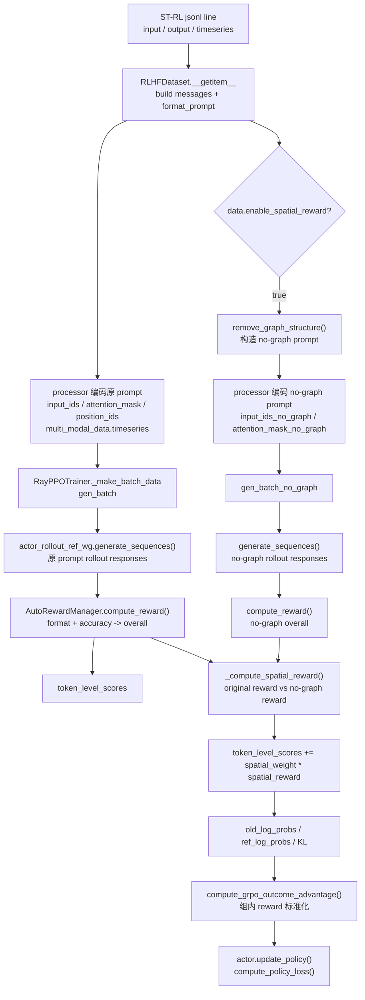

# 11 S-GRPO / RL 代码分析

本文只做静态代码阅读，不运行 Stage 3、Ray、vLLM rollout、DeepSpeed、RL 训练或模型加载。

结论标记约定：

- `已从代码确认`：能直接绑定到文件、函数、行号。
- `根据代码推断，未由真实运行验证`：来自静态链路和配置组合，但没有实际跑 RL。
- `尚未确认`：代码证据不足或需要真实数据 / 运行验证。

## 1. Stage 3 入口

`已从代码确认`：README 把 Stage 3 定义为 RL with S-GRPO，并给出两个 8B 入口：with Spatial-aware GRPO 使用 `scripts/qwen3-8b/train_stage1+2+3_w_spatial.sh`，vanilla GRPO 使用 `scripts/qwen3-8b/train_stage1+2+3.sh`，见 `README.md:44-50`、`README.md:106-127`。

Stage 3 官方 8B 主线入口：

```text
bash scripts/qwen3-8b/train_stage1+2+3_w_spatial.sh
  -> python3 -m src.EasyR1.verl.trainer.main
  -> src/EasyR1/verl/trainer/main.py:main()
  -> Runner.run()
  -> create_dataloader()
  -> AutoRewardManager()
  -> RayPPOTrainer.fit()
```

`已从代码确认`：S-GRPO 脚本从 `./output/Qwen3-8B-stage1+2` 继续训练，训练文件是四类 `ST-Bench/ST-RL/*.jsonl`，验证文件是四类 `ST-Bench/ST-Test/*.jsonl`，字段键为 `input/timeseries/output`，reward function 是 `./src/EasyR1/examples/reward_function/str.py:compute_score`，rollout 每题生成 `n=8` 个 response，见 `scripts/qwen3-8b/train_stage1+2+3_w_spatial.sh:5-23`。

`已从代码确认`：Python 入口 `src/EasyR1/verl/trainer/main.py:92-103` 先用 OmegaConf 合并 `config.yaml` 和命令行覆盖项，再调用 `ppo_config.deep_post_init()`。`Runner.run()` 中加载 tokenizer / processor，构造 reward manager 和 dataloader，最后创建 `RayPPOTrainer` 并执行 `trainer.fit()`，见 `src/EasyR1/verl/trainer/main.py:36-89`。

`已从代码确认`：默认 RL 配置文件是 `src/EasyR1/examples/config.yaml`。其中 `algorithm.adv_estimator: grpo`，`algorithm.use_kl_loss: true`，`algorithm.kl_coef: 1.0e-2`，默认 rollout `n: 5`，但 STReasoner 脚本覆盖为 `worker.rollout.n=8`，见 `src/EasyR1/examples/config.yaml:23-28`、`src/EasyR1/examples/config.yaml:61-74`、`scripts/qwen3-8b/train_stage1+2+3_w_spatial.sh:22`。

## 2. GRPO 与 S-GRPO 脚本差异

`已从代码确认`：8B 官方 vanilla GRPO 和 S-GRPO 入口的主体配置几乎相同，主要差异集中在实验名和 spatial 开关。

| 项目 | vanilla GRPO | spatial-aware GRPO / S-GRPO | 证据 |
|---|---|---|---|
| 脚本 | `scripts/qwen3-8b/train_stage1+2+3.sh` | `scripts/qwen3-8b/train_stage1+2+3_w_spatial.sh` | README 入口见 `README.md:123-127` |
| 起始模型 | `./output/Qwen3-8B-stage1+2` | `./output/Qwen3-8B-stage1+2` | 两脚本均为第 5 行 |
| train files | 四个 `ST-RL/*.jsonl` | 同 vanilla | `scripts/qwen3-8b/train_stage1+2+3.sh:9`, `scripts/qwen3-8b/train_stage1+2+3_w_spatial.sh:9` |
| val files | 四个 `ST-Test/*.jsonl` | 同 vanilla | `scripts/qwen3-8b/train_stage1+2+3.sh:10`, `scripts/qwen3-8b/train_stage1+2+3_w_spatial.sh:10` |
| prompt / TS / answer key | `input/timeseries/output` | 同 vanilla | 两脚本第 11-14 行 |
| reward function | `str.py:compute_score` | 同 vanilla | `scripts/qwen3-8b/train_stage1+2+3.sh:21`, `scripts/qwen3-8b/train_stage1+2+3_w_spatial.sh:21` |
| rollout group size | `worker.rollout.n=8` | 同 vanilla | 两脚本第 22 行 |
| experiment name | `qwen3_8b_grpo_stage1+2+3` | `qwen3_8b_grpo_stage1+2+3_w_spatial` | 两脚本第 23 行 |
| spatial config | 无 | `algorithm.enable_spatial_reward=true`、`algorithm.spatial_reward_weight=0.1`、`data.enable_spatial_reward=true` | `scripts/qwen3-8b/train_stage1+2+3_w_spatial.sh:29-31` |

`已从代码确认`：spatial 开关在 dataclass 中有默认值。`DataConfig.enable_spatial_reward` 控制 dataset 是否构造 no-graph prompt，默认 `False`；`AlgorithmConfig.enable_spatial_reward` 控制 trainer 是否执行空间奖励分支，默认 `False`；`AlgorithmConfig.spatial_reward_weight` 默认 `0.5`，但官方 `stage1+2+3_w_spatial` 脚本覆盖为 `0.1`，见 `src/EasyR1/verl/trainer/config.py:35-60`、`src/EasyR1/verl/trainer/config.py:68-101`、`scripts/qwen3-8b/train_stage1+2+3_w_spatial.sh:29-31`。

`已从代码确认`：`data.enable_spatial_reward` 不是只停留在配置层；`create_dataloader()` 会把它传给 `RLHFDataset(enable_spatial_reward=...)`，见 `src/EasyR1/verl/trainer/data_loader.py:26-46`。

`已从代码确认`：其他 spatial 变体脚本也存在。例如 `train_stage1+3_w_spatial.sh` 从 Stage 1 模型开始，`train_stage2+3_w_spatial.sh` 从 Stage 2 模型开始，`train_stage2+3_w_spatial_only_text.sh` 使用 `ST-RL-text` 且不传 `data.ts_key=timeseries`，见 `scripts/qwen3-8b/train_stage1+3_w_spatial.sh:5-31`、`scripts/qwen3-8b/train_stage2+3_w_spatial.sh:5-31`、`scripts/qwen3-8b/train_stage2+3_w_spatial_only_text.sh:5-30`。

`根据代码推断，未由真实运行验证`：官方 “with spatial structure / without spatial structure” 在主线代码中主要不是换一套 reward function 文件，也不是换训练数据文件；它是在同一个原始样本上额外构造一个删除 `Graph Structure` 片段的 no-graph prompt，然后比较原 prompt 和 no-graph prompt 的 reward。

## 3. Reward Function

`已从代码确认`：Stage 3 脚本指定的 reward function 是 `src/EasyR1/examples/reward_function/str.py:compute_score`，见 `scripts/qwen3-8b/train_stage1+2+3_w_spatial.sh:21` 和 `scripts/qwen3-8b/train_stage1+2+3.sh:21`。

`已从代码确认`：reward manager 会动态加载脚本指定的 Python 文件和函数名。`RewardConfig.post_init()` 解析 `path:function` 格式，见 `src/EasyR1/verl/workers/reward/config.py:25-40`；`AutoRewardManager.__init__()` 用 `importlib` 加载该函数，见 `src/EasyR1/verl/workers/reward/function.py:107-145`。

`已从代码确认`：`str.py` 中存在 format reward 和 accuracy reward。

| reward | 文件 / 函数 | 逻辑 | 输出键 |
|---|---|---|---|
| format reward | `src/EasyR1/examples/reward_function/str.py:12-15`, `format_reward()` | 用正则要求 response 完整匹配 `<think>...</think><answer>...</answer>` 格式 | `format` |
| accuracy reward | `src/EasyR1/examples/reward_function/str.py:71-99`, `accuracy_reward()` | 先抽取 `<answer>` 内容；单字母答案用 `mathruler.grader.grade_answer`；数值列表答案用相对误差奖励；其他情况回退到 `grade_answer` | `accuracy` |
| overall reward | `src/EasyR1/examples/reward_function/str.py:101-108`, `compute_score()` | `overall = (1 - format_weight) * accuracy + format_weight * format`，默认 `format_weight=0.5` | `overall` |

`已从代码确认`：`str.py` 没有名为 `spatial_reward()` 的独立函数；spatial reward 不在 reward function 文件里实现，而是在 trainer 中比较 original/no-graph 两个 rollout 的 rule-based reward 后生成，见 `src/EasyR1/verl/trainer/ray_trainer.py:466-494`。

`已从代码确认`：`REWARD_TYPE = "sequential"`，因此 `AutoRewardManager.compute_reward()` 会走 `compute_reward_sequential()`。该函数逐条 decode response，把 `response`、`response_length`、`ground_truth` 传给 `str.py:compute_score()`，并把 `score["overall"]` 放到最后一个有效 response token 位置，见 `src/EasyR1/examples/reward_function/str.py:7-9`、`src/EasyR1/verl/workers/reward/function.py:49-71`。

## 4. Spatial Reward 证据

`已从代码确认`：spatial reward 的数据侧入口是 `RLHFDataset`。当 `data.enable_spatial_reward=true` 且样本含 `timeseries` 字段时，dataset 会：

1. 对原始 prompt 走 `processor.apply_chat_template()` 和 `processor(timeseries=..., text=[prompt])`，得到原 prompt 的 `input_ids/attention_mask`，见 `src/EasyR1/verl/utils/dataset.py:313-319`。
2. 调用 `remove_graph_structure(messages)` 构造 no-graph messages，见 `src/EasyR1/verl/utils/dataset.py:321-334`。
3. 对 no-graph prompt 使用同一条 `timeseries` 再编码一次，写入 `input_ids_no_graph/attention_mask_no_graph/prompt_no_graph`，见 `src/EasyR1/verl/utils/dataset.py:327-334`。
4. 后处理 no-graph 的 `position_ids`、padding/truncation 和 `raw_prompt_ids_no_graph`，见 `src/EasyR1/verl/utils/dataset.py:388-421`。

`已从代码确认`：`remove_graph_structure()` 的具体规则是删除 prompt 中从 `Graph Structure:` 到 `please analyze` 之前的文本片段，正则是 `Graph Structure:.*?(?=please analyze)`，见 `src/EasyR1/verl/utils/dataset.py:35-56`。

`已从代码确认`：spatial reward 的 trainer 侧入口是 `RayPPOTrainer._compute_spatial_reward()`。它把 original reward 和 no-graph reward 沿 response token 维度求和；如果 `original_r > no_graph_r * 0.8`，就在该样本最后一个有效 response token 位置写入 `1.0`，否则写入 `0.0`，见 `src/EasyR1/verl/trainer/ray_trainer.py:466-494`。

`已从代码确认`：训练时如果 `algorithm.enable_spatial_reward=true` 且 batch 里存在 no-graph keys，trainer 会分别生成原 prompt response 和 no-graph response，分别调用同一个 `reward_fn.compute_reward()`，然后把 original reward 存到 `token_level_scores`，把比较结果存到 `spatial_reward`，见 `src/EasyR1/verl/trainer/ray_trainer.py:526-550`、`src/EasyR1/verl/trainer/ray_trainer.py:570-605`。

`已从代码确认`：真正进入 GRPO advantage 前，trainer 会把 `spatial_reward_weight * spatial_reward` 加到 `token_level_scores`，再进入 KL / advantage 逻辑，见 `src/EasyR1/verl/trainer/ray_trainer.py:724-740`。

`已从代码确认`：with / without spatial structure 在代码中的体现如下。

| 维度 | 代码体现 | 结论 |
|---|---|---|
| 数据差异 | 官方 vanilla 和 S-GRPO 主线都读同一组 `ST-RL/*.jsonl`；text-only ablation 才读 `ST-RL-text/*.jsonl` | 主线不是数据文件差异 |
| prompt 差异 | S-GRPO 在 dataset 内部额外构造 no-graph prompt，删除 `Graph Structure` 片段 | 有 prompt 对照差异 |
| reward 差异 | reward function 文件相同，S-GRPO 在 trainer 里额外计算 spatial bonus | 有 trainer 级 reward 差异 |
| 配置差异 | S-GRPO 多出 `data.enable_spatial_reward=true`、`algorithm.enable_spatial_reward=true`、`algorithm.spatial_reward_weight=0.1` | 有配置差异 |
| time series 差异 | no-graph prompt 仍复制原 batch 的 `multi_modal_data["timeseries"]` | 主线 no-graph 对照仍保留 TS 数值输入，见 `src/EasyR1/verl/trainer/ray_trainer.py:540-542` |

## 5. RL 训练流

`已从代码确认`：一轮训练的静态链路如下。



关键函数解释：

- `RLHFDataset.__getitem__()`：构造 prompt、编码 TS 多模态输入、保存 `ground_truth`，见 `src/EasyR1/verl/utils/dataset.py:264-386`。
- `RayPPOTrainer._make_batch_data()`：从 dataloader 取 batch，生成原 prompt responses；spatial 开启时额外生成 no-graph responses，见 `src/EasyR1/verl/trainer/ray_trainer.py:500-650`。
- `AutoRewardManager.compute_reward()`：调用 `str.py:compute_score()`，把 scalar reward 放在最后一个 response token 上，见 `src/EasyR1/verl/workers/reward/function.py:49-71`、`src/EasyR1/verl/workers/reward/function.py:138-145`。
- `compute_grpo_outcome_advantage()`：对同一 uid / index 的多个 rollout response，把总 reward 做组内均值方差标准化，并把结果扩展到 response mask 上；`uid` 从 `RayPPOTrainer.compute_advantage()` 传入，见 `src/EasyR1/verl/trainer/ray_trainer.py:137-156` 和 `src/EasyR1/verl/trainer/core_algos.py:175-216`。
- `DPActor.update_policy()`：重新前向计算当前 policy 的 log probs，调用 `compute_policy_loss()` 得到 clipped policy loss，并反向更新 actor，见 `src/EasyR1/verl/workers/actor/dp_actor.py:219-289`、`src/EasyR1/verl/trainer/core_algos.py:409-496`。

`已从代码确认`：GRPO 要求每个 prompt 生成多个 response。`RayPPOTrainer.__init__()` 在 `adv_estimator in [GRPO, RLOO]` 且 `rollout.n == 1` 时抛错，见 `src/EasyR1/verl/trainer/ray_trainer.py:234-236`；STReasoner 脚本设置 `worker.rollout.n=8`，见 `scripts/qwen3-8b/train_stage1+2+3_w_spatial.sh:22`。

## 6. 尚未确认问题

1. `尚未确认`：本次没有下载真实 `data/ST-Bench/ST-RL/*.jsonl`，因此没有验证真实 prompt 中 `Graph Structure: ... please analyze` 片段是否总能被 `remove_graph_structure()` 正则正确删除。
2. `尚未确认`：没有运行 Ray / EasyR1 / vLLM rollout，因此没有验证原 prompt 和 no-graph prompt 在真实 batch 中的 shape、padding、TS placeholder、`multi_modal_data["timeseries"]` 对齐是否完全正确。
3. `尚未确认`：没有把论文 S-GRPO 数学公式逐项对照代码；当前只能确认代码实现了 “original reward 与 no-graph reward 对比 + spatial bonus 加权注入 GRPO score”。
4. `尚未确认`：`original_r > no_graph_r * 0.8` 这个阈值来自代码实现，本文没有确认它是否与论文公式或实验设置完全一致。
5. `尚未确认`：text-only / image-only spatial 脚本属于 ablation 还是额外实验，需要结合论文实验表和真实数据说明确认。代码只能确认这些入口存在。
6. `尚未确认`：未实际运行 Stage 3，因此 checkpoint 保存路径、WandB 日志、reward metrics 和 `spatial_reward` 曲线没有运行结果验证。

## 7. 组会讲法

### 本文档核心结论

1. `已从代码确认`：Stage 3 入口是 EasyR1 / verl 的 `python3 -m src.EasyR1.verl.trainer.main`，官方 8B S-GRPO 脚本是 `scripts/qwen3-8b/train_stage1+2+3_w_spatial.sh`。
2. `已从代码确认`：vanilla GRPO 和 S-GRPO 主线使用相同模型、相同 ST-RL 数据、相同 `str.py:compute_score` reward function、相同 `worker.rollout.n=8`；S-GRPO 额外打开 spatial 数据构造和 trainer 奖励注入。
3. `已从代码确认`：accuracy reward 和 format reward 在 `src/EasyR1/examples/reward_function/str.py` 中实现；spatial reward 在 `src/EasyR1/verl/trainer/ray_trainer.py:_compute_spatial_reward()` 中实现。
4. `已从代码确认`：S-GRPO 的代码实现是：同一条样本生成 original prompt response 和删除 `Graph Structure` 后的 no-graph response，比较两者 rule-based reward，如果原 prompt 更好，就给原 response 额外 spatial bonus，再进入 GRPO advantage 和 policy update。
5. `根据代码推断，未由真实运行验证`：这套机制的直觉是鼓励模型真正利用空间结构文本，而不是只靠时间序列或题面其它信息得到答案。

### 组会可讲版本

我读到的 Stage 3 不是普通单样本 RL，而是 GRPO：每个 prompt 采样 8 个回答，用 reward 给每个回答打分，再在同一组回答内部做相对优势标准化。代码入口在 EasyR1 的 `RayPPOTrainer` 和 `core_algos.compute_grpo_outcome_advantage()`。

STReasoner 的 S-GRPO 在 vanilla GRPO 外面加了一条 spatial 对照分支。数据仍是同一条 ST-RL 样本，reward function 也还是 format + accuracy；区别是代码额外构造一个 no-graph prompt，把 `Graph Structure` 段删除，但保留同一条 time series。训练时模型分别回答原 prompt 和 no-graph prompt，如果原 prompt 的 reward 明显高于 no-graph reward，代码就在原回答最后一个 token 位置加 spatial reward，再乘 `spatial_reward_weight` 注入 GRPO 的 `token_level_scores`。

因此，组会上可以把 S-GRPO 简化讲成一句话：它不是单独训练一个 spatial reward model，而是用“带图结构 prompt vs 去图结构 prompt”的 reward 差值做对照，奖励那些确实从空间结构中获得性能提升的回答。

### 后续需要验证的问题

1. 下载小样本 ST-RL 后，检查真实 prompt 是否都含有 `Graph Structure` 和 `please analyze`，以及 no-graph 正则是否稳定。
2. 做小规模 dry run 或 mock batch，验证 spatial 开关打开时 `input_ids_no_graph`、`position_ids_no_graph`、`multi_modal_data.timeseries` 和原 batch 对齐。
3. 对照论文公式，确认 `original_r > no_graph_r * 0.8` 和 `spatial_reward_weight=0.1` 是否是论文最终实验设置。
4. 检查真实训练日志中是否记录 `reward/format`、`reward/accuracy`、`reward/spatial_reward`，并确认它们如何影响最终 advantage。
