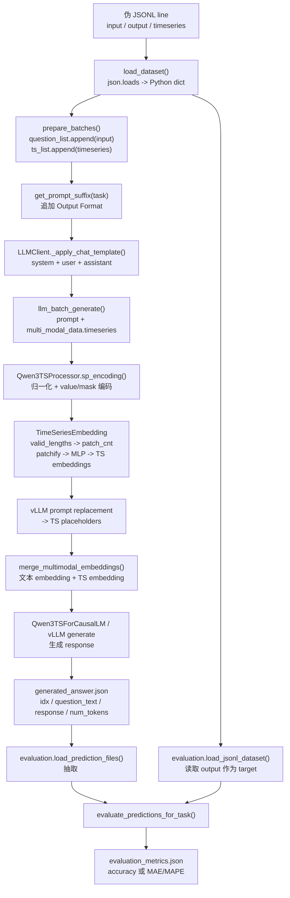

# 14 单样本端到端追踪

本文构造一条“结构化伪样本”，只展示字段、张量和函数流动，不代表真实 ST-Bench 样本，也不代表真实模型输出。本文主线按当前推理路径 `inference/inference_tsmllm_vllm.py + vLLM TS model + evaluation/evaluate.py` 追踪。

结论标记：

- `已从代码确认`：由具体文件、类、函数和行号支持。
- `根据代码推断，未由真实运行验证`：静态代码支持该流程，但本次没有运行模型。
- `伪样本`：为了讲清字段结构而构造的非真实数据。

## 1. 伪样本

`伪样本`：下面不是可直接运行的 JSONL，而是字段结构示意。真实 JSONL 中 `timeseries` 应是数值 list。

```text
{
  "input": "You are a spatial temporal analysis expert. "
           "Node 0 time series with length of 16: <ts><ts/>; "
           "Node 1 time series with length of 16: <ts><ts/>; "
           "Graph Structure: Node 0->Node 1, "
           "please analyze the spatial temporal data and answer the following question: "
           "Which entity should Node 1 correspond to? "
           "Options: A. ... B. ... C. ... D. ...",
  "output": "B",
  "timeseries": [
    [node0_t0, node0_t1, ..., node0_t15],
    [node1_t0, node1_t1, ..., node1_t15]
  ]
}
```

字段含义：

| 字段 | 作用 | 代码证据 |
|---|---|---|
| `input` | 完整自然语言题面，已经包含 Node 描述、`<ts><ts/>` 占位符、`Graph Structure` 和问题 | 推理时 `prepare_batches()` 直接读取 `sample["input"]`，见 `inference/inference_tsmllm_vllm.py:136-140` |
| `output` | 标准答案；推理阶段不用，evaluation 阶段作为 target | 多选评估读取 `sample.get("output")`，见 `evaluation/evaluate_qa.py:286-299` |
| `timeseries` | 与题面中的两个 `<ts><ts/>` 占位符一一对应 | `prepare_batches()` 遍历 `sample.get("timeseries", [])`，见 `inference/inference_tsmllm_vllm.py:140-148` |

`已从代码确认`：普通 ST-Test / ST-RL / ST-Align 等时序数据在 registry 中都使用 `input/output/timeseries` 三列，见 `data/dataset_info.json:82-145`。

## 2. 数据加载

`已从代码确认`：推理脚本通过 `load_dataset(dataset_path)` 逐行 `json.loads(line)`，把 JSONL 变成 Python `list[dict]`，见 `inference/inference_tsmllm_vllm.py:98-106`。

加载后，单条样本在 Python 中的结构可抽象为：

```python
sample = {
    "input": "... Node 0 ... <ts><ts/> ... Graph Structure: Node 0->Node 1 ...",
    "output": "B",
    "timeseries": [
        [node0_t0, node0_t1, "...", node0_t15],
        [node1_t0, node1_t1, "...", node1_t15],
    ],
}
```

`已从代码确认`：`prepare_batches(dataset, max_samples)` 会把这个 dict 拆成两个并行 list：

```python
question_list = [
    sample["input"]
]

ts_list = [
    [
        [node0_t0, ..., node0_t15],
        [node1_t0, ..., node1_t15],
    ]
]
```

对应代码：

- `question_list.append(sample["input"])`：`inference/inference_tsmllm_vllm.py:136-140`
- 递归把 `timeseries` 中的值转成 float list：`inference/inference_tsmllm_vllm.py:127-148`

## 3. Prompt 构造

`已从代码确认`：`question` 不经过额外 graph parser。`input` 字段整体作为 question 进入 `question_list`，见 `inference/inference_tsmllm_vllm.py:136-140`。

`已从代码确认`：`graph text` 也不是单独字段。它是 `input` 文本中的一段：

```text
Graph Structure: Node 0->Node 1,
```

因此，graph text 进入 prompt 的方式是：原始 JSONL 的 `input` 字段已经包含它；推理脚本只把完整 `input` 送入 `question_list`。

`已从代码确认`：推理主函数会根据 task 从 `inference/prompt.json` 读取 `prompt_suffix`，再追加到每条 question 末尾，见 `inference/prompt_utils.py:27-38`、`inference/inference_tsmllm_vllm.py:272-277`。

对 `reasoning_entity`，suffix 是：

```text
Output Format: <think>Your step-by-step reasoning process</think><answer>Your final answer(Note: Only output a single uppercase letter of the correct option)</answer>
```

证据见 `inference/prompt.json:8-10`。

`已从代码确认`：`LLMClient.llm_batch_generate()` 默认会再套一层 chat template：system prompt + user prompt，见 `inference/llm_utils.py:270-275`、`inference/llm_utils.py:311-337`。

最终进入 vLLM 前的结构可以抽象为：

```python
inputs = {
    "prompt": "<chat_template>"
              "<system>You are a helpful assistant.</system>"
              "<user>"
              "原始 input，含 <ts><ts/> 和 Graph Structure"
              "\n\nOutput Format: ..."
              "</user>"
              "<assistant>",
    "multi_modal_data": {
        "timeseries": [
            [node0_t0, ..., node0_t15],
            [node1_t0, ..., node1_t15],
        ]
    }
}
```

## 4. Time Series 编码

`已从代码确认`：`Qwen3TSProcessor` 会按 `<ts><ts/>` 占位符切 prompt，并对每条对应的 time series 调用 `sp_encoding()`，见 `base_model/Config-Qwen3-8B/processing_qwen3_ts.py:122-143`。

对单条长度 16 的伪序列：

```text
raw series:
  [node0_t0, node0_t1, ..., node0_t15]

sp_encoding():
  1. 转为 numpy array
  2. 计算 mean
  3. 减 mean
  4. 如幅度过大则按 scale_factor 缩放
  5. 生成 value/mask 成对特征
```

证据：

- 均值中心化和缩放：`base_model/Config-Qwen3-8B/processing_qwen3_ts.py:36-42`
- 生成带 offset / scaling / length 的 `<ts>` 文本片段：`base_model/Config-Qwen3-8B/processing_qwen3_ts.py:44-46`
- 生成 `[value, mask]` 交错结构：`base_model/Config-Qwen3-8B/processing_qwen3_ts.py:48`

`已从代码确认`：vLLM 路径下，processor 会把 `timeseries` 输出成 `zip(ts_tokens, encoded_ts_arrays)`，见 `base_model/Config-Qwen3-8B/processing_qwen3_ts.py:164-171`。

`已从代码确认`：模型配置中 `patch_size=8`、`num_features=2`、`hidden_size=4096`，见 `base_model/Config-Qwen3-8B/config.json:73-83`。

伪样本中每个节点序列长度为 16：

```text
valid_lengths = 16
patch_size = 8
patch_cnt = ceil(16 / 8) = 2
```

`已从代码确认`：HF 模型实现中的公式是 `patch_cnt = (valid_lengths + patch_size - 1) // patch_size`，见 `base_model/Config-Qwen3-8B/modeling_qwen3_ts.py:83-87`。

`已从代码确认`：进入 `TimeSeriesEmbedding.forward()` 后，输入会 reshape 为 `[batch_size, L, num_features]`，并把最后一维当 mask，见 `base_model/Config-Qwen3-8B/modeling_qwen3_ts.py:80-86`。

Patchify 示意：

```text
node0 time series length 16
  -> patch 0: [t0 ... t7]
  -> patch 1: [t8 ... t15]
  -> 2 个 TS embedding token

node1 time series length 16
  -> patch 0: [t0 ... t7]
  -> patch 1: [t8 ... t15]
  -> 2 个 TS embedding token
```

`已从代码确认`：patch 输入最终会拼成 `x_patches` 并经过 `self.mlp(x_patches)` 得到 TS embedding，见 `base_model/Config-Qwen3-8B/modeling_qwen3_ts.py:171-179`。

## 5. Embedding 合并

`已从代码确认`：实际 vLLM 推理路径先做 prompt replacement。`_get_prompt_updates()` 会找到 time series 占位符，并根据 `patch_cnt` 扩展 placeholder token 数量，见 `inference/vllm/chatts_vllm.py:352-401`。

伪样本的文本 token 序列可以抽象为：

```text
合并前文本 token:
  [普通文本: "Node 0 time series ...",
   <ts>, <ts/>,
   普通文本: "; Node 1 time series ...",
   <ts>, <ts/>,
   普通文本: "Graph Structure: Node 0->Node 1 ..."]
```

`已从代码确认`：vLLM 模型侧会从 `multi_modal_data["timeseries"]` 解析出 encoded TS arrays，拼成 `concatenated_ts`，见 `inference/vllm/chatts_vllm.py:628-671`。

`已从代码确认`：`get_multimodal_embeddings()` 调用 `self.ts_encoder(ts_input)` 得到 `ts_features, patch_cnt`，并按每条 time series 的 patch count 切回 list，见 `inference/vllm/chatts_vllm.py:673-697`。

`已从代码确认`：`get_input_embeddings()` 先拿普通文本 embedding，再调用 `merge_multimodal_embeddings(input_ids, inputs_embeds, multimodal_embeddings, self.config.ts_token_start_index)` 把 TS embedding 合并进去，见 `inference/vllm/chatts_vllm.py:699-709`。

合并后可以抽象为：

```text
合并后 embedding 序列:
  [文本 embedding: "Node 0 time series ...",
   node0_patch0_embedding,
   node0_patch1_embedding,
   文本 embedding: "; Node 1 time series ...",
   node1_patch0_embedding,
   node1_patch1_embedding,
   文本 embedding: "Graph Structure: Node 0->Node 1 ..."]
```

`根据代码推断，未由真实运行验证`：这个合并结果表示 LLM 的 attention 序列里同时包含文本 token embedding、图结构文本 token embedding、以及由数值 time series 产生的 patch embedding。

补充：HF 路径里也有同等概念的合并函数 `_merge_input_ids_with_time_series_features()`，它用 `ts_token_start_index` / `ts_token_end_index` 找 TS 特殊 token，并根据 `patch_cnt` 扩展序列，见 `base_model/Config-Qwen3-8B/modeling_qwen3_ts.py:387-433`、`base_model/Config-Qwen3-8B/modeling_qwen3_ts.py:580-588`。

## 6. Generation

`已从代码确认`：`answer_question_list()` 创建 `LLMClient(engine="vllm-ts")`，调用 `llm_client.llm_batch_generate(question_list, ts_list, sampling_params=...)`，最后把每条 answer 包装成 `{"response": answer}`，见 `inference/inference_tsmllm_vllm.py:70-95`。

`已从代码确认`：`llm_batch_generate()` 在有 `batch_timeseries` 时会把单条输入包装成：

```python
{
    "prompt": prompt_after_chat_template,
    "multi_modal_data": {
        "timeseries": batch_timeseries[i]
    }
}
```

证据见 `inference/llm_utils.py:311-337`。

`伪样本`：模型生成结果只写结构，不表示真实输出：

```text
<think>
MODEL_REASONING_TEXT
</think>
<answer>
PREDICTED_OPTION
</answer>
```

如果 `PREDICTED_OPTION` 是 `B`，evaluation 会把它和 `output="B"` 比较；如果不是 `B`，则判错。这里不假设真实模型会生成哪个选项。

## 7. 保存输出

`已从代码确认`：推理主函数把 `answers` 写成 `generated_answer` list，每条包含：

```python
{
    "idx": idx,
    "question_text": question_list[idx],
    "response": ans["response"],
    "num_tokens": input_token_counts[idx],
}
```

证据见 `inference/inference_tsmllm_vllm.py:308-317`。

保存到文件：

```python
output_file = os.path.join(exp_dir, args.output_name)
json.dump(generated_answer, fh, ensure_ascii=False, indent=4)
```

证据见 `inference/inference_tsmllm_vllm.py:319-322`。

伪输出结构：

```json
[
  {
    "idx": 0,
    "question_text": "原始 input + prompt_suffix",
    "response": "<think>MODEL_REASONING_TEXT</think><answer>PREDICTED_OPTION</answer>",
    "num_tokens": 123
  }
]
```

`根据代码推断，未由真实运行验证`：`num_tokens=123` 是结构占位，不是真实统计值。本地已有 `exp_STReasoner-8B/*/generated_answer.json` 没有 `num_tokens`，当前脚本会写该字段。

## 8. Evaluation

`已从代码确认`：evaluation 的 `load_jsonl_dataset()` 会重新读取测试集 JSONL，并给每条样本补默认 `idx=行号`，见 `evaluation/evaluate_qa.py:69-79`。

`已从代码确认`：`load_prediction_files()` 会扫描 `exp_dir` 中文件名包含 `generated_answer` 的 JSON 文件，读取 entry 的 `idx` 和 `response`，并抽取 `<answer>...</answer>` 内容，见 `evaluation/evaluate_qa.py:82-127`。

对伪样本：

```text
dataset[0]["output"] = "B"
prediction[0] = "PREDICTED_OPTION"
```

`已从代码确认`：如果任务是 `reasoning_entity`，会走 `evaluate_multiple_choice_predictions()`。它读取 target 和 prediction，标准化 A-D 字母后比较，输出 `accuracy`，见 `evaluation/evaluate_qa.py:278-317`。

评分逻辑：

```text
if normalize_choice(PREDICTED_OPTION) == normalize_choice("B"):
    correct += 1
else:
    correct += 0

accuracy = correct / evaluated_samples
```

`已从代码确认`：如果任务是 `reasoning_forecasting`，则会走 `evaluate_forecasting_predictions()`，把标准答案和预测答案解析为数值序列，长度对齐后计算 MAE / MAPE，见 `evaluation/evaluate_qa.py:198-275`。

`已从代码确认`：`evaluation/evaluate.py` 会把 metrics 写入同一实验目录下的 `evaluation_metrics.json`，见 `evaluation/evaluate.py:160-174`。

## 9. 总流程图



### 本文档核心结论

1. `已从代码确认`：单样本从 JSONL 到推理的核心字段是 `input` 和 `timeseries`；`output` 只在 evaluation 中使用。
2. `已从代码确认`：`Graph Structure` 不是单独变量，而是 `input/question_text` 的一段文本，随 question 一起进入 prompt。
3. `已从代码确认`：`timeseries` 通过 `ts_list` 进入 `multi_modal_data.timeseries`，再由 processor 和 `TimeSeriesEmbedding` 编成 patch embeddings。
4. `已从代码确认`：TS embedding 在 vLLM 路径中通过 prompt replacement 和 `merge_multimodal_embeddings()` 插入文本 embedding 序列。
5. `已从代码确认`：最终 `generated_answer.json` 由 `idx` 对齐回测试集，evaluation 从 `<answer>` 抽最终答案并评分。

### 组会可讲版本

一条样本最开始就是三列：`input` 是完整题面，里面已经写好了节点、`<ts><ts/>` 和 `Graph Structure`；`timeseries` 是真实数值序列；`output` 是标准答案。推理时脚本把 `input` 放入 `question_list`，把 `timeseries` 放入 `ts_list`，再追加输出格式 prompt。

模型实际看到的不是纯文本。文本里 `<ts><ts/>` 是占位符，真实数值序列通过 `multi_modal_data.timeseries` 进入 processor。processor 做归一化和 value/mask 编码，`TimeSeriesEmbedding` 按 patch_size=8 切 patch 并投影成 Qwen hidden size 的 embedding。vLLM 再把这些 TS embedding 插入到文本 embedding 序列中，让 LLM 同时 attend 到题面文本、图结构文本和时序 patch token。

生成后，结果保存成 `generated_answer.json`。评估脚本按 `idx` 对齐原测试集，从 `<answer>` 里抽最终答案；多选任务算 accuracy，forecasting 任务解析数值序列算 MAE/MAPE。

### 后续需要验证的问题

1. 用真实 ST-Bench 样本验证 `input` 中 `<ts><ts/>` 的数量是否始终等于 `timeseries` 列表长度。
2. 用一条真实样本跑轻量 mock 或小模型环境，核对 vLLM prompt replacement 后的 placeholder 数是否等于 patch embedding 数。
3. 用当前推理脚本生成一条真实 `generated_answer.json`，确认 `num_tokens` 和 evaluation 读取逻辑完全匹配。
